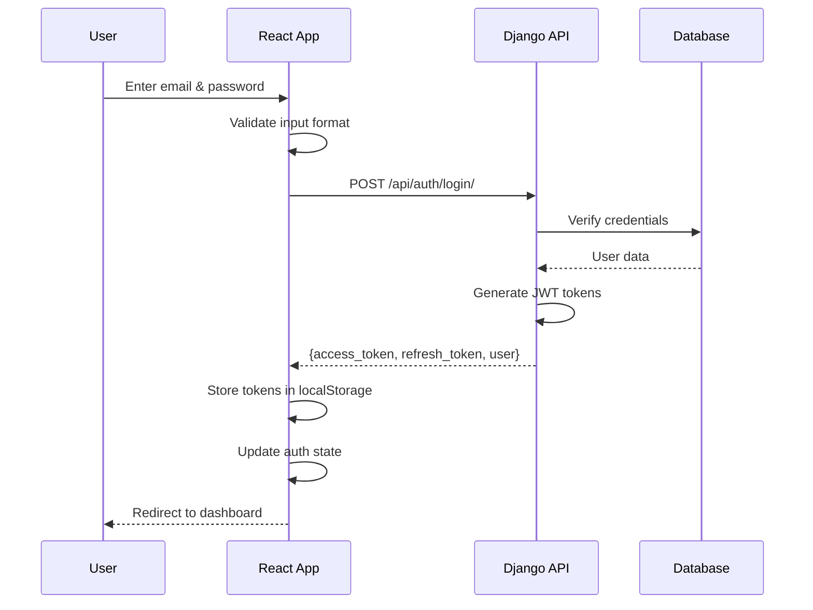
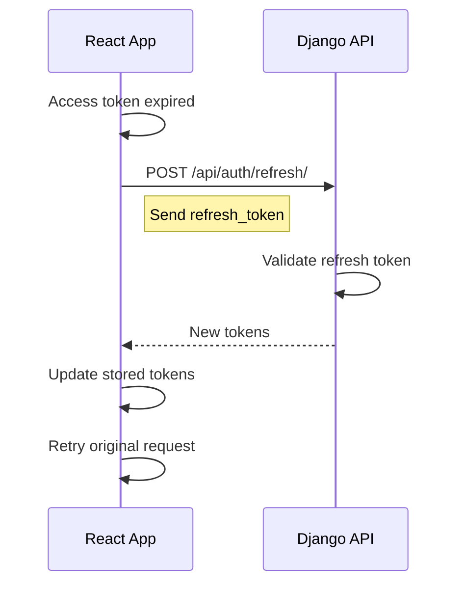

# React Sign-In Implementation Specification

## Project Overview

**Objective**: Create a modern React-based sign-in system to replace the deprecated HTMX web interface, implementing JWT authentication for the Naga Student Information System staff portal.

**Repository**: `/Volumes/Projects/naga-monorepo-v1-final`

## 1. Technical Requirements

### 1.1 Technology Stack
- **Frontend Framework**: React 18+ with TypeScript
- **Build Tool**: Vite
- **State Management**: Zustand
- **UI Library**: Ant Design 5.x
- **Styling**: Tailwind CSS
- **HTTP Client**: Axios
- **Form Validation**: React Hook Form + Zod
- **Routing**: React Router v6

### 1.2 Project Location
```
naga-monorepo-v1-final/
└── staff-web/              # New React application (to be created)
    ├── src/
    ├── public/
    ├── package.json
    ├── tsconfig.json
    ├── vite.config.ts
    └── project.json        # NX configuration
```

### 1.3 Backend Integration Points
- **API Base URL**: `http://localhost:8001/api/`
- **Authentication Endpoints**: Already created at `/backend/api/v1/auth_endpoints.py`
- **Django Settings**: Already fixed to use `apps.web_interface_deprecated`

## 2. Authentication Flow Specification

### 2.1 Sign-In Flow


### 2.2 Token Refresh Flow


## 3. API Endpoints (Already Implemented)

### 3.1 Login Endpoint
**POST** `/api/auth/login/`

**Request Body:**
```json
{
  "email": "user@example.com",
  "password": "userpassword"
}
```

**Response (200 OK):**
```json
{
  "access_token": "eyJ0eXAiOiJKV1QiLCJhbGc...",
  "refresh_token": "eyJ0eXAiOiJKV1QiLCJhbGc...",
  "token_type": "Bearer",
  "expires_in": 3600,
  "user": {
    "id": 1,
    "email": "user@example.com",
    "first_name": "John",
    "last_name": "Doe",
    "full_name": "John Doe",
    "is_staff": true,
    "is_superuser": false,
    "roles": ["staff", "academic"]
  }
}
```

**Error Response (401):**
```json
{
  "error": "Invalid credentials"
}
```

### 3.2 Refresh Token Endpoint
**POST** `/api/auth/refresh/`

**Request Body:**
```json
{
  "refresh_token": "eyJ0eXAiOiJKV1QiLCJhbGc..."
}
```

**Response:** Same as login endpoint

### 3.3 Get Profile Endpoint
**GET** `/api/auth/profile/`

**Headers:**
```
Authorization: Bearer <access_token>
```

**Response:**
```json
{
  "id": 1,
  "email": "user@example.com",
  "first_name": "John",
  "last_name": "Doe",
  "is_staff": true,
  "is_superuser": false,
  "roles": ["staff", "academic"]
}
```

### 3.4 Logout Endpoint
**POST** `/api/auth/logout/`

**Headers:**
```
Authorization: Bearer <access_token>
```

**Response:**
```json
{
  "message": "Logged out successfully"
}
```

## 4. Frontend Implementation Requirements

### 4.1 Directory Structure
```
staff-web/src/
├── components/
│   ├── auth/
│   │   ├── LoginForm.tsx
│   │   ├── LoginForm.test.tsx
│   │   └── LoginForm.module.css
│   └── common/
│       ├── LoadingSpinner.tsx
│       └── ErrorMessage.tsx
├── pages/
│   ├── Login/
│   │   ├── index.tsx
│   │   └── Login.module.css
│   └── Dashboard/
│       └── index.tsx
├── services/
│   ├── api.ts              # Axios instance configuration
│   └── auth.service.ts     # Authentication service
├── store/
│   └── authStore.ts        # Zustand auth state
├── hooks/
│   ├── useAuth.ts
│   └── useAxiosInterceptor.ts
├── types/
│   └── auth.types.ts
├── utils/
│   ├── tokenStorage.ts
│   └── constants.ts
├── App.tsx
├── main.tsx
└── router.tsx
```

### 4.2 Component Specifications

#### 4.2.1 LoginForm Component
```typescript
// components/auth/LoginForm.tsx
interface LoginFormProps {
  onSuccess?: () => void;
  onError?: (error: string) => void;
}

interface LoginFormData {
  email: string;
  password: string;
  rememberMe?: boolean;
}

const LoginForm: React.FC<LoginFormProps>
```

**Features:**
- Email validation (must be valid email format)
- Password field with show/hide toggle
- Remember me checkbox (optional)
- Loading state during submission
- Error message display
- Keyboard support (Enter to submit)
- Auto-focus on email field on mount

#### 4.2.2 Login Page
```typescript
// pages/Login/index.tsx
const LoginPage: React.FC
```

**Features:**
- Centered card layout
- School logo/branding
- Login form integration
- Redirect to dashboard on success
- Redirect if already authenticated
- Responsive design (mobile-first)

### 4.3 Service Layer

#### 4.3.1 API Configuration
```typescript
// services/api.ts
import axios from 'axios';

const API_BASE_URL = import.meta.env.VITE_API_URL || 'http://localhost:8001/api';

const apiClient = axios.create({
  baseURL: API_BASE_URL,
  headers: {
    'Content-Type': 'application/json',
  },
});

// Request interceptor for auth token
apiClient.interceptors.request.use((config) => {
  const token = localStorage.getItem('access_token');
  if (token) {
    config.headers.Authorization = `Bearer ${token}`;
  }
  return config;
});

// Response interceptor for token refresh
apiClient.interceptors.response.use(
  (response) => response,
  async (error) => {
    // Handle 401 and refresh token
  }
);

export default apiClient;
```

#### 4.3.2 Authentication Service
```typescript
// services/auth.service.ts
interface LoginCredentials {
  email: string;
  password: string;
}

interface AuthTokens {
  access_token: string;
  refresh_token: string;
  expires_in: number;
}

interface User {
  id: number;
  email: string;
  first_name: string;
  last_name: string;
  full_name: string;
  is_staff: boolean;
  is_superuser: boolean;
  roles: string[];
}

class AuthService {
  async login(credentials: LoginCredentials): Promise<{ tokens: AuthTokens; user: User }>;
  async refreshToken(refreshToken: string): Promise<AuthTokens>;
  async getProfile(): Promise<User>;
  async logout(): Promise<void>;
  isAuthenticated(): boolean;
  getAccessToken(): string | null;
  getRefreshToken(): string | null;
  clearTokens(): void;
}

export default new AuthService();
```

### 4.4 State Management

#### 4.4.1 Auth Store (Zustand)
```typescript
// store/authStore.ts
interface AuthState {
  user: User | null;
  isAuthenticated: boolean;
  isLoading: boolean;
  error: string | null;

  // Actions
  login: (credentials: LoginCredentials) => Promise<void>;
  logout: () => void;
  refreshAuth: () => Promise<void>;
  clearError: () => void;
}

const useAuthStore = create<AuthState>((set, get) => ({
  // Implementation
}));
```

### 4.5 Routing Configuration

```typescript
// router.tsx
import { createBrowserRouter } from 'react-router-dom';

const router = createBrowserRouter([
  {
    path: '/login',
    element: <LoginPage />,
  },
  {
    path: '/',
    element: <ProtectedRoute />,
    children: [
      {
        index: true,
        element: <Dashboard />,
      },
      // Other protected routes
    ],
  },
]);

// ProtectedRoute component
const ProtectedRoute: React.FC = () => {
  const { isAuthenticated } = useAuthStore();

  if (!isAuthenticated) {
    return <Navigate to="/login" replace />;
  }

  return <Outlet />;
};
```

## 5. Security Requirements

### 5.1 Token Storage
- Store access token in localStorage (for persistence)
- Store refresh token in localStorage (separate key)
- Clear tokens on logout
- Implement token expiry checking

### 5.2 Request Security
- All API requests must use HTTPS in production
- Include CSRF token if Django CSRF protection is enabled
- Sanitize all user inputs
- Implement rate limiting on login attempts (frontend side)

### 5.3 Error Handling
- Never expose sensitive information in error messages
- Log errors to console in development only
- Implement proper error boundaries
- Handle network failures gracefully

## 6. UI/UX Requirements

### 6.1 Login Page Design
- **Layout**: Centered card with form
- **Branding**: School logo at top
- **Fields**: Email and password inputs
- **Actions**: Sign In button, Remember Me checkbox
- **Feedback**: Loading spinner, error messages
- **Responsive**: Mobile-first design

### 6.2 Visual Specifications
```css
/* Color Palette */
--primary: #1890ff;    /* Ant Design blue */
--success: #52c41a;
--warning: #faad14;
--error: #f5222d;
--background: #f0f2f5;
--card-bg: #ffffff;
--text-primary: #000000d9;
--text-secondary: #00000073;

/* Spacing */
--spacing-xs: 8px;
--spacing-sm: 12px;
--spacing-md: 16px;
--spacing-lg: 24px;
--spacing-xl: 32px;

/* Typography */
--font-family: -apple-system, BlinkMacSystemFont, 'Segoe UI', Roboto, 'Helvetica Neue', Arial;
--font-size-base: 14px;
--font-size-lg: 16px;
--font-size-xl: 20px;
```

### 6.3 Responsive Breakpoints
- Mobile: < 768px
- Tablet: 768px - 1024px
- Desktop: > 1024px

## 7. Testing Requirements

### 7.1 Unit Tests
```typescript
// LoginForm.test.tsx
describe('LoginForm', () => {
  it('should render email and password fields');
  it('should validate email format');
  it('should require password');
  it('should disable submit button while loading');
  it('should display error messages');
  it('should call onSuccess after successful login');
});
```

### 7.2 Integration Tests
```typescript
// auth.service.test.ts
describe('AuthService', () => {
  it('should login with valid credentials');
  it('should handle login failure');
  it('should refresh token when expired');
  it('should clear tokens on logout');
});
```

### 7.3 E2E Tests
```typescript
// login.e2e.test.ts
describe('Login Flow', () => {
  it('should login and redirect to dashboard');
  it('should show error for invalid credentials');
  it('should persist login on page refresh');
  it('should logout and redirect to login');
});
```

## 8. Development Setup Instructions

### 8.1 Create React Project
```bash
# From monorepo root
npm create vite@latest staff-web -- --template react-ts
cd staff-web
npm install
```

### 8.2 Install Dependencies
```bash
npm install axios react-router-dom zustand antd @ant-design/icons
npm install react-hook-form @hookform/resolvers zod
npm install -D @types/react @types/react-dom tailwindcss postcss autoprefixer
npm install -D @testing-library/react @testing-library/jest-dom vitest
```

### 8.3 Configure Tailwind
```bash
npx tailwindcss init -p
```

### 8.4 Configure NX
Create `staff-web/project.json`:
```json
{
  "name": "staff-web",
  "$schema": "../node_modules/nx/schemas/project-schema.json",
  "projectType": "application",
  "sourceRoot": "staff-web/src",
  "targets": {
    "dev": {
      "executor": "nx:run-commands",
      "options": {
        "command": "npm run dev",
        "cwd": "staff-web"
      }
    },
    "build": {
      "executor": "nx:run-commands",
      "options": {
        "command": "npm run build",
        "cwd": "staff-web"
      }
    },
    "test": {
      "executor": "nx:run-commands",
      "options": {
        "command": "npm run test",
        "cwd": "staff-web"
      }
    }
  },
  "tags": ["type:app", "scope:web", "platform:browser"]
}
```

### 8.5 Environment Variables
Create `staff-web/.env.development`:
```env
VITE_API_URL=http://localhost:8001/api
VITE_APP_NAME=Naga SIS Staff Portal
```

## 9. Acceptance Criteria

### 9.1 Functional Requirements
- [ ] User can enter email and password
- [ ] User can submit form by clicking button or pressing Enter
- [ ] System validates email format before submission
- [ ] System shows loading state during authentication
- [ ] System displays error message for invalid credentials
- [ ] System redirects to dashboard after successful login
- [ ] System stores JWT tokens securely
- [ ] System refreshes token automatically when expired
- [ ] User can logout and tokens are cleared

### 9.2 Non-Functional Requirements
- [ ] Page loads in under 2 seconds
- [ ] Form submission responds in under 3 seconds
- [ ] Works on mobile devices (responsive)
- [ ] Accessible via keyboard navigation
- [ ] WCAG 2.1 AA compliant
- [ ] Works in Chrome, Firefox, Safari, Edge

### 9.3 Security Requirements
- [ ] Passwords are not stored in plain text
- [ ] Tokens expire after specified time
- [ ] Failed login attempts are rate-limited
- [ ] HTTPS enforced in production
- [ ] XSS protection implemented

## 10. Deliverables Checklist

### Phase 1: Setup (Day 1)
- [ ] Create `staff-web` React project
- [ ] Install all dependencies
- [ ] Configure Vite, TypeScript, Tailwind
- [ ] Setup NX integration
- [ ] Configure ESLint and Prettier

### Phase 2: Core Implementation (Days 2-3)
- [ ] Implement API service layer
- [ ] Create auth store with Zustand
- [ ] Build LoginForm component
- [ ] Create Login page
- [ ] Setup routing with protected routes
- [ ] Implement token interceptors

### Phase 3: Integration (Day 4)
- [ ] Connect to Django backend
- [ ] Test login flow end-to-end
- [ ] Implement token refresh
- [ ] Add error handling
- [ ] Add loading states

### Phase 4: Polish (Day 5)
- [ ] Add unit tests
- [ ] Add integration tests
- [ ] Improve UI/UX
- [ ] Add accessibility features
- [ ] Documentation

## 11. Known Issues & Notes

### 11.1 Backend Status
- ✅ Django auth endpoints created at `/backend/api/v1/auth_endpoints.py`
- ✅ JWT authentication configured with PyJWT
- ⚠️ Backend server needs restart to load new endpoints
- ✅ Test user: `stark.jeffrey@pucsr.edu.kh` / `Nolbu0728!`

### 11.2 Current System State
- Deprecated HTMX interface at root path ("/")
- Django admin at `/admin/`
- API at `/api/` with django-ninja
- Mobile app exists with React Native

### 11.3 Migration Notes
- This React app will eventually replace `apps.web_interface_deprecated`
- Future: Integration with Authelia for SSO
- Mobile app will continue using direct JWT

## 12. API Testing Commands

```bash
# Test login endpoint
curl -X POST http://localhost:8001/api/auth/login/ \
  -H "Content-Type: application/json" \
  -d '{"email":"stark.jeffrey@pucsr.edu.kh","password":"Nolbu0728!"}'

# Test profile endpoint (replace TOKEN)
curl -X GET http://localhost:8001/api/auth/profile/ \
  -H "Authorization: Bearer YOUR_ACCESS_TOKEN"

# Test refresh endpoint
curl -X POST http://localhost:8001/api/auth/refresh/ \
  -H "Content-Type: application/json" \
  -d '{"refresh_token":"YOUR_REFRESH_TOKEN"}'
```

## 13. Questions for Implementation Team

1. **Branding**: What logo/colors should be used for the login page?
2. **Session Management**: Should "Remember Me" extend token lifetime?
3. **Password Reset**: Should we implement forgot password in Phase 1?
4. **2FA**: Should we prepare for 2FA integration in the UI?
5. **Language**: Should the interface support Khmer language?

---

**Handoff Notes**: This specification provides everything needed to implement the React sign-in system. The Django backend is already prepared with JWT endpoints. Focus on creating the React frontend in the `staff-web` directory as a new project within the monorepo.