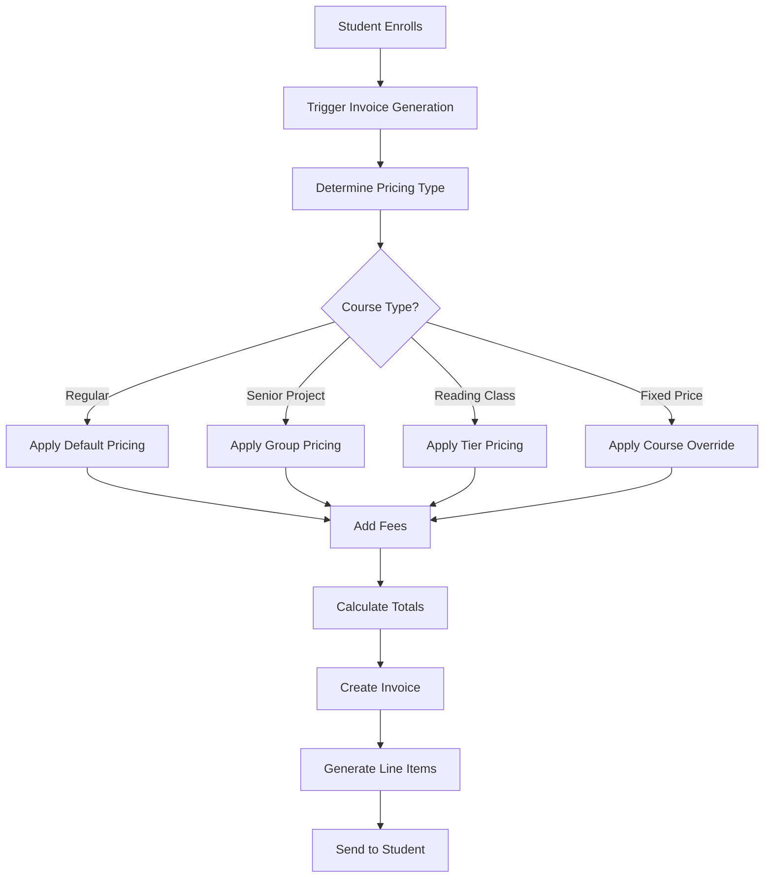
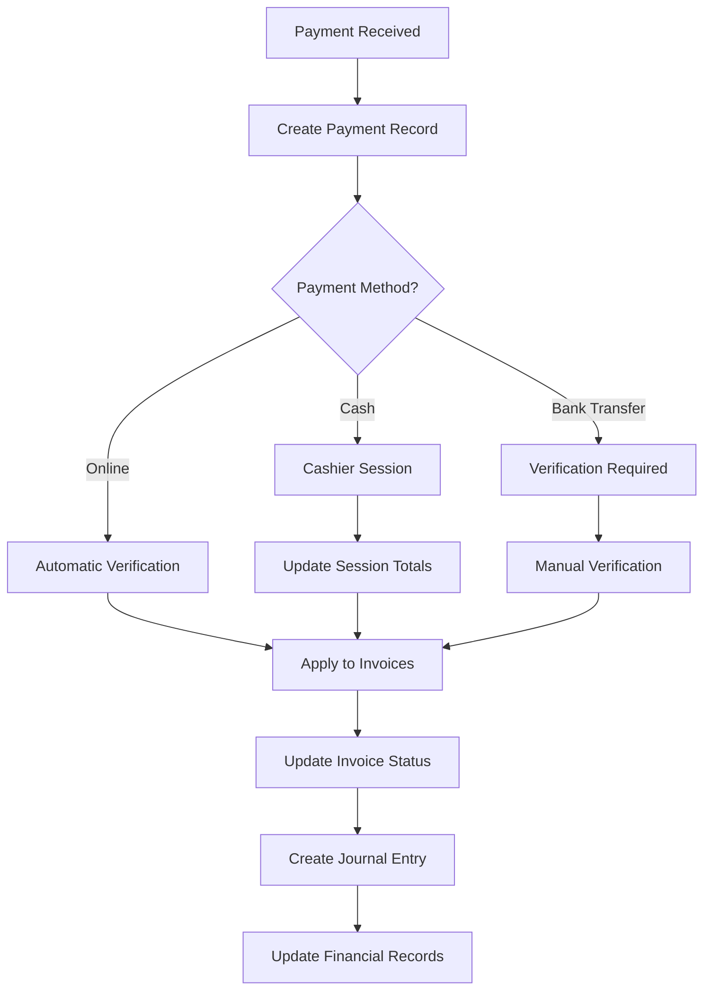
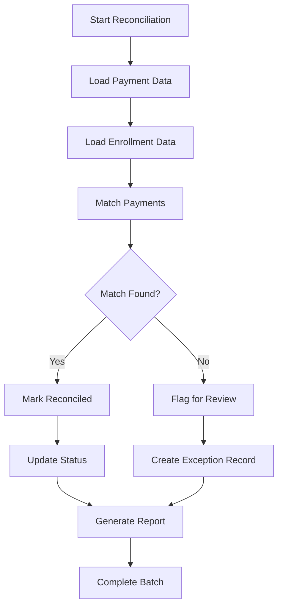
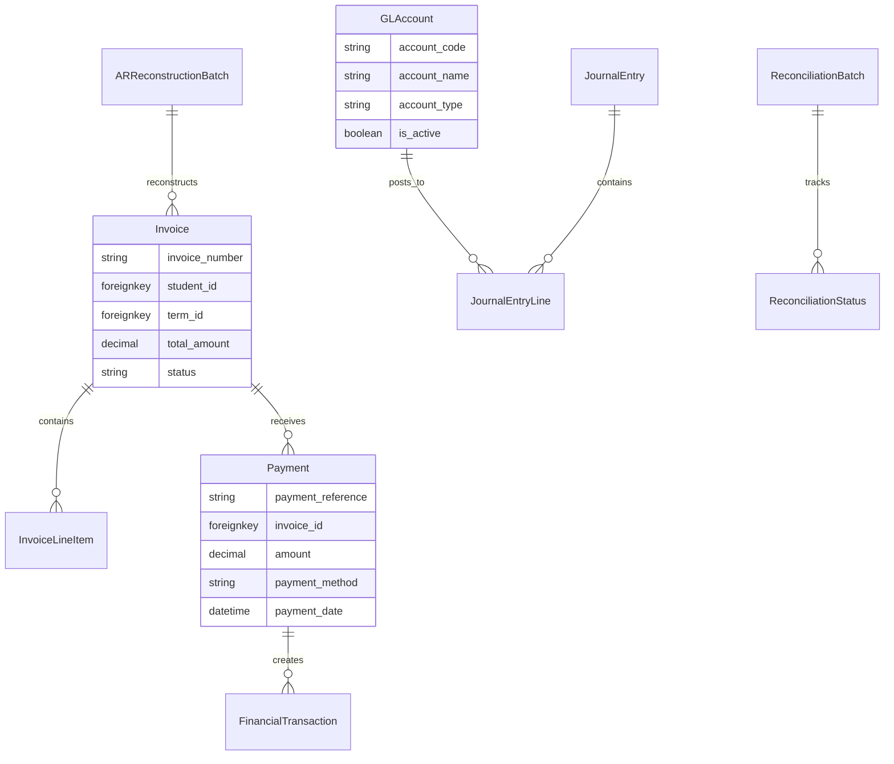

# Naga SIS Finance App - Developer Guide

**Version**: 1.0  
**Created**: January 2025  
**Author**: Claude Code  
**Last Updated**: January 2025

## 📋 Table of Contents

1. [Architecture Overview](#architecture-overview)
2. [Model Layer Documentation](#model-layer-documentation)
3. [Service Layer Reference](#service-layer-reference)
4. [Management Commands](#management-commands)
5. [Business Logic & Workflows](#business-logic--workflows)
6. [Integration Patterns](#integration-patterns)
7. [Database Schema](#database-schema)
8. [Developer Guidelines](#developer-guidelines)
9. [Testing Strategy](#testing-strategy)
10. [Performance Considerations](#performance-considerations)

---

## 🏗️ Architecture Overview

### Clean Architecture Implementation

The Finance app follows strict clean architecture principles with **zero circular dependencies**:

```
Foundation Layer:    accounts/, common/, geography/, facilities/
Domain Layer:        people/, academic/, enrollment/, scheduling/
Business Logic:      finance/ (this app)
Service Layer:       QuickBooks, Payment Gateways, GL Systems
```

### Multi-Environment Support

The Finance app operates in two critical database environments:

- **MIGRATION Environment**: Contains real legacy data from previous system
- **LOCAL/TEST Environment**: Safe development and testing environment

**⚠️ CRITICAL**: Always verify which environment you're working with before executing any financial operations.

### Core Financial Principles

1. **Service Accounting**: Cash-based accounting following SERVICE accounting principles
2. **Double-Entry Bookkeeping**: All transactions maintain balanced journal entries
3. **Audit Trail**: Complete tracking of all financial transactions
4. **Flexible Pricing**: Configurable pricing structures for different scenarios
5. **Legacy Data Preservation**: Maintains historical data integrity during migrations

---

## 📊 Model Layer Documentation

### Model Organization

The Finance app organizes models into logical modules for maintainability:

```python
# Model structure in apps/finance/models/
├── __init__.py          # Public API and model exports
├── core.py              # Core financial models (Invoice, Payment, etc.)
├── pricing.py           # Pricing models (DefaultPricing, CoursePricing, etc.)
├── gl.py                # General Ledger and accounting models
├── reconciliation.py    # Payment reconciliation models
└── ar_reconstruction.py # A/R reconstruction for legacy data
```

### Core Financial Models (`core.py`)

#### Invoice
Primary billing model for student charges.

```python
class Invoice(UserAuditModel):
    """Student invoice model for billing management."""
    
    # Key fields
    invoice_number = models.CharField(max_length=50, unique=True)
    student = models.ForeignKey("people.StudentProfile", ...)
    term = models.ForeignKey("curriculum.Term", ...)
    status = models.CharField(choices=InvoiceStatus.choices)
    
    # Financial amounts
    subtotal = models.DecimalField(max_digits=10, decimal_places=2)
    total_amount = models.DecimalField(max_digits=10, decimal_places=2)
    paid_amount = models.DecimalField(max_digits=10, decimal_places=2)
    
    # Legacy data preservation fields
    is_historical = models.BooleanField(default=False)
    legacy_ipk = models.IntegerField(null=True, blank=True)
    reconstruction_status = models.CharField(max_length=20, blank=True)
```

**Key Methods:**
- `amount_due`: Calculate remaining balance
- `is_overdue`: Check if invoice is past due
- `calculate_totals()`: Recalculate totals from line items

#### InvoiceLineItem
Individual charges within an invoice.

```python
class InvoiceLineItem(UserAuditModel):
    """Individual line items on student invoices."""
    
    invoice = models.ForeignKey(Invoice, on_delete=models.CASCADE)
    line_item_type = models.CharField(choices=LineItemType.choices)
    description = models.CharField(max_length=255)
    
    # Pricing
    unit_price = models.DecimalField(max_digits=10, decimal_places=2)
    quantity = models.DecimalField(max_digits=6, decimal_places=2)
    line_total = models.DecimalField(max_digits=10, decimal_places=2)
    
    # Optional references
    enrollment = models.ForeignKey("enrollment.ClassHeaderEnrollment", ...)
    fee_pricing = models.ForeignKey("finance.FeePricing", ...)
```

#### Payment
Records student payments against invoices.

```python
class Payment(UserAuditModel):
    """Payment records for invoice payments."""
    
    payment_reference = models.CharField(max_length=50, unique=True)
    invoice = models.ForeignKey(Invoice, on_delete=models.PROTECT)
    amount = models.DecimalField(max_digits=10, decimal_places=2)
    
    payment_method = models.CharField(choices=PaymentMethod.choices)
    status = models.CharField(choices=PaymentStatus.choices)
    
    # Dates
    payment_date = models.DateTimeField()
    processed_date = models.DateTimeField(null=True, blank=True)
    
    # Legacy preservation
    is_historical_payment = models.BooleanField(default=False)
    legacy_ipk = models.IntegerField(null=True, blank=True)
```

**Payment Methods Supported:**
- Cash
- Credit Card
- Bank Transfer
- Check
- Online Payment
- Scholarship
- Other

#### FinancialTransaction
Comprehensive audit trail for all financial activities.

```python
class FinancialTransaction(UserAuditModel):
    """Comprehensive financial transaction log for audit trails."""
    
    transaction_id = models.CharField(max_length=50, unique=True)
    transaction_type = models.CharField(choices=TransactionType.choices)
    student = models.ForeignKey("people.StudentProfile", ...)
    amount = models.DecimalField(max_digits=10, decimal_places=2)
    
    # Related records
    invoice = models.ForeignKey(Invoice, null=True, blank=True)
    payment = models.ForeignKey(Payment, null=True, blank=True)
```

**Transaction Types:**
- Invoice Created
- Payment Received
- Payment Refunded
- Manual Adjustment
- Bad Debt Write-off

#### CashierSession
Daily cash handling tracking for financial control.

```python
class CashierSession(UserAuditModel):
    """Cashier session tracking for daily cash handling."""
    
    session_number = models.CharField(max_length=50, unique=True)
    cashier = models.ForeignKey(settings.AUTH_USER_MODEL, ...)
    
    # Session timing
    opened_at = models.DateTimeField(default=timezone.now)
    closed_at = models.DateTimeField(null=True, blank=True)
    
    # Financial balances
    opening_balance = models.DecimalField(max_digits=10, decimal_places=2)
    closing_balance = models.DecimalField(max_digits=10, decimal_places=2)
    expected_balance = models.DecimalField(max_digits=10, decimal_places=2)
```

### Pricing Models (`pricing.py`)

#### BasePricingModel
Abstract base for all pricing models with common functionality.

```python
class BasePricingModel(UserAuditModel):
    """Abstract base class for all pricing models."""
    
    effective_date = models.DateField(default=date.today)
    end_date = models.DateField(null=True, blank=True)
    notes = models.TextField(blank=True)
    
    @property
    def is_current(self) -> bool:
        """Check if this pricing is currently active."""
```

#### DefaultPricing
Standard pricing for regular courses by academic cycle.

```python
class DefaultPricing(BasePricingModel):
    """Default pricing for regular courses by cycle."""
    
    cycle = models.ForeignKey("curriculum.Cycle", on_delete=models.PROTECT)
    domestic_price = models.DecimalField(max_digits=10, decimal_places=2)
    foreign_price = models.DecimalField(max_digits=10, decimal_places=2)
    
    def get_price_for_student(self, is_foreign: bool = False) -> Decimal:
        """Get the appropriate price for a student."""
        return self.foreign_price if is_foreign else self.domestic_price
```

#### CourseFixedPricing
Course-specific pricing overrides.

```python
class CourseFixedPricing(DateRangeValidationMixin, BasePricingModel):
    """Fixed pricing for specific courses that override defaults."""
    
    course = models.ForeignKey("curriculum.Course", on_delete=models.CASCADE)
    domestic_price = models.DecimalField(max_digits=10, decimal_places=2)
    foreign_price = models.DecimalField(max_digits=10, decimal_places=2)
```

#### SeniorProjectPricing
Specialized pricing for group-based senior projects.

```python
class SeniorProjectPricing(BasePricingModel):
    """Individual pricing for senior projects based on group size."""
    
    class GroupSizeTier(models.TextChoices):
        ONE_STUDENT = "1", _("1 Student")
        TWO_STUDENTS = "2", _("2 Students")
        THREE_FOUR_STUDENTS = "3-4", _("3-4 Students")
        FIVE_STUDENTS = "5", _("5 Students")
    
    tier = models.CharField(max_length=10, choices=GroupSizeTier.choices)
    individual_price = models.DecimalField(max_digits=10, decimal_places=2)
    foreign_individual_price = models.DecimalField(max_digits=10, decimal_places=2)
    advisor_payment = models.DecimalField(max_digits=10, decimal_places=2)
    committee_payment = models.DecimalField(max_digits=10, decimal_places=2)
```

**Key Business Rule**: Each student pays the FULL individual price - prices are NOT split among group members.

#### ReadingClassPricing
Tier-based pricing for reading/request classes.

```python
class ReadingClassPricing(BasePricingModel):
    """Pricing for reading/request classes based on enrollment size."""
    
    class ClassSizeTier(models.TextChoices):
        TUTORIAL = "1-2", _("1-2 Students (Tutorial)")
        SMALL = "3-5", _("3-5 Students (Small Class)")
        MEDIUM = "6-15", _("6-15 Students (Medium Class)")
    
    cycle = models.ForeignKey("curriculum.Cycle", on_delete=models.PROTECT)
    tier = models.CharField(max_length=10, choices=ClassSizeTier.choices)
    domestic_price = models.DecimalField(max_digits=10, decimal_places=2)
    foreign_price = models.DecimalField(max_digits=10, decimal_places=2)
```

#### FeePricing
Administrative and miscellaneous fees.

```python
class FeePricing(UserAuditModel):
    """Administrative and other fees with flexible pricing rules."""
    
    name = models.CharField(max_length=100)
    fee_type = models.CharField(max_length=20, choices=FeeType)
    local_amount = models.DecimalField(max_digits=10, decimal_places=2)
    foreign_amount = models.DecimalField(max_digits=10, decimal_places=2)
    
    # Fee characteristics
    is_mandatory = models.BooleanField(default=True)
    is_per_course = models.BooleanField(default=False)
    is_per_term = models.BooleanField(default=False)
```

**Fee Types Available:**
- Registration, Application, Late Payment
- Material, Technology, Library
- Student Services, Graduation, Transcript
- ID Card, Parking, Other

### General Ledger Models (`gl.py`)

#### GLAccount
Chart of accounts for financial reporting integration.

```python
class GLAccount(UserAuditModel):
    """General Ledger account for financial reporting and integration."""
    
    account_code = models.CharField(max_length=20, unique=True)
    account_name = models.CharField(max_length=100)
    account_type = models.CharField(choices=AccountType.choices)
    account_category = models.CharField(choices=AccountCategory.choices)
    parent_account = models.ForeignKey("self", null=True, blank=True)
    
    @cached_property
    def full_account_path(self) -> str:
        """Get full hierarchical path for this account."""
```

**Account Types:**
- Asset, Liability, Equity, Revenue, Expense

**Account Categories:**
- Current Asset, Fixed Asset
- Current Liability, Long-term Liability
- Operating Revenue, Non-operating Revenue
- Operating Expense, Administrative Expense

#### JournalEntry
Complete journal entries for double-entry bookkeeping.

```python
class JournalEntry(UserAuditModel):
    """Journal entry for G/L integration and financial reporting."""
    
    entry_number = models.CharField(max_length=50, unique=True)
    entry_date = models.DateField()
    accounting_period = models.CharField(max_length=7)  # YYYY-MM format
    entry_type = models.CharField(choices=EntryType.choices)
    status = models.CharField(choices=EntryStatus.choices)
    
    # Cached totals for performance
    total_debits = models.DecimalField(max_digits=12, decimal_places=2)
    total_credits = models.DecimalField(max_digits=12, decimal_places=2)
    
    @property
    def is_balanced(self) -> bool:
        """Check if journal entry is balanced (debits = credits)."""
        
    def approve(self, user) -> None:
        """Approve this journal entry."""
        
    def post_to_gl(self) -> None:
        """Mark entry as posted to G/L."""
```

**Entry Types:**
- Revenue Receipt, Payment Receipt, Refund Issued
- Adjustment Entry, Transfer Entry
- Reversal Entry, Closing Entry

#### JournalEntryLine
Individual debit/credit lines within journal entries.

```python
class JournalEntryLine(UserAuditModel):
    """Individual line item within a journal entry."""
    
    journal_entry = models.ForeignKey(JournalEntry, on_delete=models.CASCADE)
    line_number = models.PositiveSmallIntegerField()
    gl_account = models.ForeignKey(GLAccount, on_delete=models.PROTECT)
    
    # Only one should be non-zero
    debit_amount = models.DecimalField(max_digits=12, decimal_places=2)
    credit_amount = models.DecimalField(max_digits=12, decimal_places=2)
    
    description = models.CharField(max_length=200)
    reference_type = models.CharField(max_length=50, blank=True)
    reference_id = models.CharField(max_length=50, blank=True)
```

### Reconciliation Models (`reconciliation.py`)

#### ReconciliationBatch
Batch processing for payment reconciliation runs.

```python
class ReconciliationBatch(UserAuditModel):
    """Batch processing for reconciliation runs."""
    
    batch_id = models.CharField(max_length=50, unique=True)
    batch_type = models.CharField(choices=BatchType.choices)
    start_date = models.DateField()
    end_date = models.DateField()
    status = models.CharField(choices=BatchStatus.choices)
    
    # Processing statistics
    total_payments = models.PositiveIntegerField(default=0)
    processed_payments = models.PositiveIntegerField(default=0)
    successful_matches = models.PositiveIntegerField(default=0)
    failed_matches = models.PositiveIntegerField(default=0)
```

#### ReconciliationStatus
Tracking reconciliation status for each payment with refinement capabilities.

```python
class ReconciliationStatus(UserAuditModel):
    """Track reconciliation status for each payment with refinement capabilities."""
    
    class Status(models.TextChoices):
        FULLY_RECONCILED = "FULLY_RECONCILED"
        AUTO_ALLOCATED = "AUTO_ALLOCATED"
        SCHOLARSHIP_VERIFIED = "SCHOLARSHIP_VERIFIED"
        PENDING_REVIEW = "PENDING_REVIEW"
        EXCEPTION_ERROR = "EXCEPTION_ERROR"
        UNMATCHED = "UNMATCHED"
```

### A/R Reconstruction Models (`ar_reconstruction.py`)

#### ARReconstructionBatch
Batch tracking for accounts receivable reconstruction from legacy data.

```python
class ARReconstructionBatch(TimestampedModel, UserTrackingModel):
    """Batch tracking for A/R reconstruction runs."""
    
    batch_id = models.CharField(max_length=50, unique=True)
    term_id = models.CharField(max_length=50, null=True, blank=True)
    processing_mode = models.CharField(choices=ProcessingMode.choices)
    status = models.CharField(choices=BatchStatus.choices)
    
    # Processing metrics
    total_receipts = models.PositiveIntegerField(default=0)
    processed_receipts = models.PositiveIntegerField(default=0)
    successful_reconstructions = models.PositiveIntegerField(default=0)
    failed_reconstructions = models.PositiveIntegerField(default=0)
```

---

## 🔧 Service Layer Reference

The Finance app includes 14 specialized service classes for different aspects of financial management:

### Core Services

#### InvoiceService
Handles invoice generation and management.

```python
class InvoiceService:
    """Service for invoice generation and management."""
    
    @staticmethod
    def generate_invoice_number(term, student) -> str:
        """Generate a unique invoice number."""
        
    @staticmethod
    def create_invoice_for_enrollment(enrollment, pricing_service=None):
        """Create or update invoice for student enrollment."""
        
    @staticmethod
    def calculate_invoice_totals(invoice):
        """Recalculate invoice totals from line items."""
```

#### PaymentService
Payment processing with verification workflows.

```python
class PaymentService:
    """Service for payment processing and verification."""
    
    @staticmethod
    def process_payment(student, invoice, amount, payment_method, **kwargs):
        """Process a new payment."""
        
    @staticmethod
    def verify_payment(payment, verified_by):
        """Verify a pending payment."""
        
    @staticmethod
    def apply_payment_to_invoice(payment, invoice, amount):
        """Apply payment amount to specific invoice."""
```

#### PricingService
Intelligent pricing determination engine.

```python
class PricingService:
    """Service for determining appropriate pricing for students and courses."""
    
    @staticmethod
    def get_course_price(student, course, term):
        """Get the appropriate price for a student's course enrollment."""
        
    @staticmethod
    def get_fee_price(student, fee_type):
        """Get the appropriate fee amount for a student."""
        
    @staticmethod
    def calculate_senior_project_price(course, group_size, is_foreign=False):
        """Calculate senior project pricing based on group size."""
```

### Specialized Services

#### QuickBooksService
Integration with QuickBooks accounting system.

```python
class QuickBooksService:
    """Service for QuickBooks integration and synchronization."""
    
    @staticmethod
    def sync_invoice(invoice):
        """Sync invoice to QuickBooks."""
        
    @staticmethod
    def sync_payment(payment):
        """Sync payment to QuickBooks."""
        
    @staticmethod
    def generate_gl_export(start_date, end_date):
        """Generate general ledger export for QuickBooks."""
```

#### ReconciliationService
Payment and enrollment reconciliation.

```python
class ReconciliationService:
    """Service for payment reconciliation and matching."""
    
    @staticmethod
    def reconcile_payment_batch(batch_id, parameters=None):
        """Process a batch of payments for reconciliation."""
        
    @staticmethod
    def match_payment_to_enrollment(payment, enrollment_data):
        """Attempt to match a payment to student enrollment."""
        
    @staticmethod
    def create_reconciliation_adjustment(payment, adjustment_reason, amount):
        """Create manual reconciliation adjustment."""
```

#### CashierService
Daily cashier operations and session management.

```python
class CashierService:
    """Service for cashier session management and daily cash operations."""
    
    @staticmethod
    def open_cashier_session(cashier, opening_balance):
        """Open a new cashier session."""
        
    @staticmethod
    def close_cashier_session(session, closing_balance):
        """Close cashier session with balance reconciliation."""
        
    @staticmethod
    def process_cash_payment(session, payment_data):
        """Process cash payment within cashier session."""
```

### Additional Services

- **BillingAutomationService**: Automated billing generation
- **GLIntegrationService**: General ledger integration
- **ReportService**: Financial reporting and analytics
- **TransactionService**: Financial transaction management
- **ReceiptService**: Payment receipt generation
- **ScholarshipReconciliationService**: Scholarship payment reconciliation
- **AutomaticDiscountService**: Automated discount application
- **TermDiscountValidation**: Term-based discount validation

---

## 🛠️ Management Commands

The Finance app includes 25+ management commands for various financial operations:

### Billing Commands

#### `create_default_pricing`
Sets up default pricing structures.

```bash
python manage.py create_default_pricing --academic-year=2024
```

#### `generate_monthly_journal_entries`
Creates monthly journal entries for G/L integration.

```bash
# Generate for specific month
python manage.py generate_monthly_journal_entries --year 2025 --month 1

# Generate for previous month (default)
python manage.py generate_monthly_journal_entries

# Export to file
python manage.py generate_monthly_journal_entries --export --format csv

# Dry run preview
python manage.py generate_monthly_journal_entries --dry-run
```

### Legacy Data Commands

#### `load_legacy_data`
Loads financial data from legacy system.

```bash
python manage.py load_legacy_data --source migration --term-id FALL2024
```

#### `reconstruct_ar_from_legacy`
Reconstructs accounts receivable from legacy receipts.

```bash
python manage.py reconstruct_ar_from_legacy --batch-id AR-2024-001
```

#### `reconcile_legacy_payments`
Reconciles legacy payment data with current system.

```bash
python manage.py reconcile_legacy_payments --batch-size 100
```

### Reconciliation Commands

#### `run_reconciliation`
Executes payment reconciliation process.

```bash
python manage.py run_reconciliation --start-date 2024-01-01 --end-date 2024-01-31
```

#### `run_reconciliation_batch`
Batch reconciliation processing.

```bash
python manage.py run_reconciliation_batch --batch-id RECON-2024-001
```

### Reporting Commands

#### `generate_quickbooks_reports`
Generates QuickBooks-compatible reports.

```bash
python manage.py generate_quickbooks_reports --report-type ar_aging
```

#### `generate_financial_error_report`
Creates comprehensive error analysis reports.

```bash
python manage.py generate_financial_error_report --output-format pdf
```

#### `generate_scholarship_variance_report`
Analyzes scholarship payment variances.

```bash
python manage.py generate_scholarship_variance_report --term-id FALL2024
```

### Data Analysis Commands

#### `analyze_legacy_data`
Analyzes legacy data for migration planning.

```bash
python manage.py analyze_legacy_data --comprehensive
```

#### `processing_dashboard`
Provides processing status dashboard.

```bash
python manage.py processing_dashboard --real-time
```

### Validation Commands

#### `validate_term_discounts`
Validates discount applications by term.

```bash
python manage.py validate_term_discounts --term-id FALL2024
```

#### `check_test_data`
Validates test data integrity.

```bash
python manage.py check_test_data --comprehensive
```

---

## 💼 Business Logic & Workflows

### Invoice Generation Workflow



### Payment Processing Workflow



### Reconciliation Workflow



### Pricing Determination Logic

```python
def determine_pricing(student, course, term):
    """
    Pricing precedence (highest to lowest):
    1. Course Fixed Pricing (overrides everything)
    2. Senior Project Pricing (for senior project courses)
    3. Reading Class Pricing (for reading classes)
    4. Default Pricing (by cycle)
    """
    
    # Check for course-specific fixed pricing
    fixed_pricing = CourseFixedPricing.objects.filter(
        course=course,
        effective_date__lte=term.start_date,
        end_date__isnull=True
    ).first()
    
    if fixed_pricing:
        return fixed_pricing.get_price_for_student(student.is_foreign)
    
    # Check for senior project pricing
    if hasattr(course, 'senior_project_config'):
        # Determine group size and apply appropriate tier pricing
        return get_senior_project_pricing(course, group_size, student.is_foreign)
    
    # Check for reading class pricing
    if is_reading_class(course):
        enrollment_count = get_enrollment_count(course, term)
        tier = determine_reading_class_tier(enrollment_count)
        return get_reading_class_pricing(course.cycle, tier, student.is_foreign)
    
    # Fall back to default pricing
    default_pricing = DefaultPricing.objects.filter(
        cycle=course.cycle,
        effective_date__lte=term.start_date,
        end_date__isnull=True
    ).first()
    
    return default_pricing.get_price_for_student(student.is_foreign)
```

---

## 🔗 Integration Patterns

### With Enrollment App

```python
# Signal handler for enrollment creation
@receiver(post_save, sender=ClassHeaderEnrollment)
def create_enrollment_billing(sender, instance, created, **kwargs):
    if created:
        InvoiceService.create_invoice_for_enrollment(instance)
```

### With People App

```python
# Student profile integration
def get_student_financial_summary(student_profile):
    return {
        'outstanding_balance': calculate_outstanding_balance(student_profile),
        'total_charges': calculate_total_charges(student_profile),
        'total_payments': calculate_total_payments(student_profile),
        'last_payment_date': get_last_payment_date(student_profile)
    }
```

### With Curriculum App

```python
# Course and term integration
def get_term_financial_summary(term):
    return {
        'total_billing': calculate_term_billing(term),
        'collection_rate': calculate_collection_rate(term),
        'outstanding_receivables': calculate_outstanding_ar(term)
    }
```

### QuickBooks Integration

```python
# Automatic sync on financial events
class QuickBooksIntegration:
    @staticmethod
    def sync_invoice(invoice):
        qb_client = get_quickbooks_client()
        qb_invoice = convert_to_qb_format(invoice)
        return qb_client.create_invoice(qb_invoice)
    
    @staticmethod
    def sync_payment(payment):
        qb_client = get_quickbooks_client()
        qb_payment = convert_payment_to_qb_format(payment)
        return qb_client.create_payment(qb_payment)
```

---

## 🗄️ Database Schema

### Key Indexes

```sql
-- Performance indexes
CREATE INDEX idx_invoice_student_term ON finance_invoice (student_id, term_id);
CREATE INDEX idx_payment_date_status ON finance_payment (payment_date, status);
CREATE INDEX idx_gl_account_type ON finance_gl_account (account_type, is_active);

-- Reconciliation indexes
CREATE INDEX idx_recon_status_batch ON finance_reconciliation_status (batch_id, status);
CREATE INDEX idx_ar_batch_term ON finance_ar_reconstruction_batch (term_id, status);
```

### Foreign Key Relationships



### Data Integrity Constraints

```sql
-- Prevent negative amounts
ALTER TABLE finance_invoice ADD CONSTRAINT chk_invoice_positive_amounts 
    CHECK (subtotal >= 0 AND total_amount >= 0 AND paid_amount >= 0);

-- Ensure balanced journal entries
ALTER TABLE finance_journal_entry ADD CONSTRAINT chk_journal_balanced 
    CHECK (total_debits = total_credits);

-- Prevent overlapping pricing periods
ALTER TABLE finance_default_pricing ADD CONSTRAINT uniq_current_default_per_cycle 
    EXCLUDE USING gist (cycle WITH =) WHERE (end_date IS NULL);
```

---

## 👨‍💻 Developer Guidelines

### Code Style Standards

```python
# ✅ Good: Proper decimal handling
amount = Decimal('125.50')
total = normalize_decimal(amount * quantity)

# ❌ Bad: Float arithmetic
amount = 125.50
total = amount * quantity

# ✅ Good: Explicit status checks
if invoice.status == Invoice.InvoiceStatus.PAID:
    process_paid_invoice(invoice)

# ❌ Bad: Magic strings
if invoice.status == 'PAID':
    process_paid_invoice(invoice)
```

### Error Handling Patterns

```python
def process_payment(payment_data):
    try:
        with transaction.atomic():
            payment = create_payment(payment_data)
            invoice = payment.invoice
            
            # Validate payment amount
            if payment.amount > invoice.amount_due:
                raise FinancialError(
                    f"Payment amount {payment.amount} exceeds due amount {invoice.amount_due}"
                )
            
            # Apply payment
            apply_payment_to_invoice(payment, invoice)
            create_financial_transaction(payment)
            
    except FinancialError as e:
        logger.error(f"Financial validation error: {e}")
        raise
    except Exception as e:
        logger.error(f"Unexpected error processing payment: {e}")
        raise FinancialError("Payment processing failed")
```

### Security Considerations

```python
# ✅ Good: Permission-based access
@require_finance_permission('view_financial_data')
def get_student_balance(request, student_id):
    student = get_object_or_404(StudentProfile, id=student_id)
    return calculate_balance(student)

# ✅ Good: Input validation
def create_payment(amount, payment_method):
    if amount <= 0:
        raise ValidationError("Payment amount must be positive")
    
    if payment_method not in Payment.PaymentMethod.values:
        raise ValidationError("Invalid payment method")
```

### Testing Patterns

```python
class InvoiceServiceTest(TestCase):
    def setUp(self):
        self.student = StudentProfileFactory()
        self.term = TermFactory()
        self.course = CourseFactory()
        
    def test_invoice_creation(self):
        enrollment = EnrollmentFactory(
            student=self.student,
            class_header__term=self.term,
            class_header__course=self.course
        )
        
        invoice = InvoiceService.create_invoice_for_enrollment(enrollment)
        
        self.assertIsNotNone(invoice)
        self.assertEqual(invoice.student, self.student)
        self.assertEqual(invoice.term, self.term)
        self.assertGreater(invoice.total_amount, 0)
        
    @patch('apps.finance.services.QuickBooksService.sync_invoice')
    def test_quickbooks_integration(self, mock_sync):
        invoice = InvoiceFactory()
        mock_sync.return_value = {'id': 'QB123'}
        
        result = QuickBooksService.sync_invoice(invoice)
        
        mock_sync.assert_called_once_with(invoice)
        self.assertEqual(result['id'], 'QB123')
```

---

## 🧪 Testing Strategy

### Test Categories

1. **Unit Tests**: Individual model methods and service functions
2. **Integration Tests**: Cross-app interactions and external service integration
3. **Financial Tests**: Decimal precision, balance calculations, accounting rules
4. **Workflow Tests**: Complete business process validation
5. **Performance Tests**: Large dataset handling and optimization

### Test Factories

```python
# apps/finance/tests/factories.py
class InvoiceFactory(factory.django.DjangoModelFactory):
    class Meta:
        model = Invoice
    
    invoice_number = factory.Sequence(lambda n: f"INV-2024-{n:06d}")
    student = factory.SubFactory(StudentProfileFactory)
    term = factory.SubFactory(TermFactory)
    total_amount = factory.Faker('pydecimal', left_digits=4, right_digits=2, positive=True)
    status = Invoice.InvoiceStatus.DRAFT

class PaymentFactory(factory.django.DjangoModelFactory):
    class Meta:
        model = Payment
    
    payment_reference = factory.Sequence(lambda n: f"PAY-2024-{n:06d}")
    invoice = factory.SubFactory(InvoiceFactory)
    amount = factory.Faker('pydecimal', left_digits=3, right_digits=2, positive=True)
    payment_method = Payment.PaymentMethod.BANK_TRANSFER
    payment_date = factory.Faker('date_time_this_year')
```

### Critical Test Cases

```python
def test_decimal_precision():
    """Test decimal precision in financial calculations."""
    amount1 = Decimal('100.33')
    amount2 = Decimal('200.67')
    total = amount1 + amount2
    
    assert total == Decimal('301.00')
    assert len(str(total).split('.')[1]) <= 2  # Max 2 decimal places

def test_journal_entry_balance():
    """Test journal entry must be balanced."""
    entry = JournalEntryFactory()
    
    # Add debit line
    JournalEntryLineFactory(
        journal_entry=entry,
        debit_amount=Decimal('500.00'),
        credit_amount=Decimal('0.00')
    )
    
    # Add credit line
    JournalEntryLineFactory(
        journal_entry=entry,
        debit_amount=Decimal('0.00'),
        credit_amount=Decimal('500.00')
    )
    
    entry.calculate_totals()
    assert entry.is_balanced
```

---

## ⚡ Performance Considerations

### Database Optimization

```python
# ✅ Efficient: Use select_related for foreign keys
invoices = Invoice.objects.select_related('student', 'term').filter(
    status=Invoice.InvoiceStatus.OUTSTANDING
)

# ✅ Efficient: Use prefetch_related for reverse foreign keys
invoices = Invoice.objects.prefetch_related('line_items', 'payments').all()

# ✅ Efficient: Aggregate calculations at database level
balance_summary = Invoice.objects.filter(student=student).aggregate(
    total_charges=Sum('total_amount'),
    total_paid=Sum('paid_amount')
)
```

### Batch Processing

```python
def process_monthly_billing(students, batch_size=100):
    """Process billing in batches for memory efficiency."""
    
    for student_batch in chunk_list(students, batch_size):
        invoices_to_create = []
        
        for student in student_batch:
            invoice_data = calculate_student_billing(student)
            invoices_to_create.append(Invoice(**invoice_data))
        
        # Bulk create for efficiency
        created_invoices = Invoice.objects.bulk_create(invoices_to_create)
        
        # Create line items separately
        create_bulk_line_items(created_invoices)
```

### Caching Strategies

```python
from django.core.cache import cache

def get_student_balance(student_id):
    cache_key = f"student_balance_{student_id}"
    balance = cache.get(cache_key)
    
    if balance is None:
        balance = calculate_student_balance(student_id)
        cache.set(cache_key, balance, timeout=3600)  # 1 hour
    
    return balance

def invalidate_student_cache(student_id):
    """Invalidate cache when student financial data changes."""
    cache_key = f"student_balance_{student_id}"
    cache.delete(cache_key)
```

### Memory Management

```python
def process_large_reconciliation_batch(batch_id):
    """Process large batches with memory efficiency."""
    
    batch = ReconciliationBatch.objects.get(batch_id=batch_id)
    
    # Process in chunks to avoid memory issues
    payment_queryset = Payment.objects.filter(
        payment_date__range=[batch.start_date, batch.end_date]
    )
    
    for payment_chunk in payment_queryset.iterator(chunk_size=1000):
        process_payment_reconciliation(payment_chunk)
        
        # Explicitly trigger garbage collection for large batches
        if batch.total_payments > 10000:
            import gc
            gc.collect()
```

---

## 📚 Additional Resources

### Related Documentation

- [COMPREHENSIVE_FINANCE_DOCUMENTATION.md](./COMPREHENSIVE_FINANCE_DOCUMENTATION.md) - Complete system overview
- [PRICING_REDESIGN_SPEC.md](./PRICING_REDESIGN_SPEC.md) - Pricing system specifications
- [PRICING_MIGRATION_PLAN.md](./PRICING_MIGRATION_PLAN.md) - Migration strategy
- [docs/RECONCILIATION_ENGINE_DESIGN.md](./docs/RECONCILIATION_ENGINE_DESIGN.md) - Reconciliation system design

### External Dependencies

- **Django**: Web framework and ORM
- **PostgreSQL**: Primary database with dual-environment support
- **Decimal**: Python decimal library for financial precision
- **QuickBooks API**: External accounting system integration
- **Celery**: Background task processing (future enhancement)

### API Documentation

The Finance app provides REST API endpoints through django-ninja:

- Invoice management endpoints
- Payment processing endpoints
- Financial reporting endpoints
- Student financial summary endpoints

See `apps/finance/api.py` for complete API documentation.

---

**Last Updated**: January 2025  
**Maintainer**: Naga SIS Development Team  
**Version**: 1.0.0