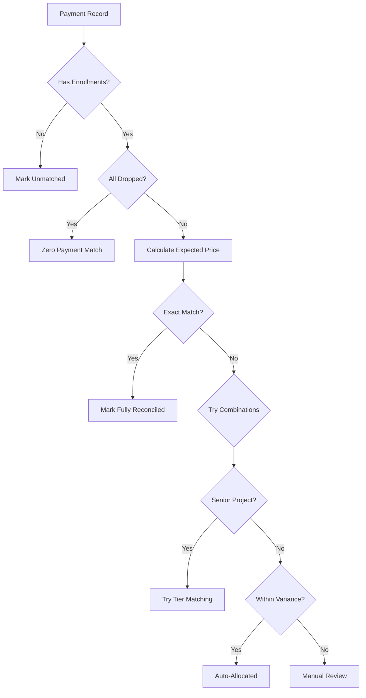

# Reconciliation Engine Design

## Overview

This document describes the design of the price determination engine for the reconciliation system, based on the business rules in "BA Academic Pricing and LANGUAGE.pdf".

## Architecture Components

### 1. Price Determination Engine (`price_determination_engine.py`)

The core engine that determines the correct price for courses based on:

- **Default Pricing**: Standard per-cycle pricing (BA/MA/LANG)
- **Fixed Course Pricing**: Specific courses with override prices
- **Senior Project Pricing**: Tiered pricing based on group size (1, 2, 3-4, 5 students)
- **Reading Class Pricing**: Small class pricing based on enrollment (1-2, 3-5, 6-15 students)

#### Key Features:

1. **Historical Pricing Support**: Uses effective dates from pricing tables
2. **Foreign/Domestic Distinction**: Different prices based on citizenship
3. **Pattern Recognition**: Identifies reading classes by keywords (READ, REQ, SPECIAL)
4. **Senior Project Detection**: Recognizes courses IR-489, BUS-489, FIN-489, THM-433

### 2. Enhanced Reconciliation Service (`enhanced_reconciliation_service.py`)

Extends the base reconciliation service with intelligent matching strategies:

#### Matching Strategies:

1. **Dropped Course Match**: Zero payment for all dropped courses
2. **Exact Match**: Payment exactly matches calculated price (within $1)
3. **Combination Match**: Tries different course combinations
4. **Senior Project Tier Match**: Attempts to determine group size by payment amount
5. **Partial Match**: Accepts matches within materiality threshold

#### Confidence Scoring:

- **100%**: Exact match
- **95%**: Match within 2% variance
- **85%**: Match within 5% variance
- **75%**: Match within 10% variance
- **60%+**: Pattern-based matches

### 3. Data Preparation (`prepare_reconciliation_data.py`)

Management command to load legacy CSV data:

- `all_students_250728.csv`: Student data with citizenship
- `all_receipt_headers_250728.csv`: Payment records
- `all_academiccoursetakers_250728.csv`: Enrollment records
- `all_academicclasses_250728.csv`: Class information

## Business Rules Implementation

### 1. Price Type Determination

```python
def _determine_price_type(enrollment):
    if is_senior_project(course):
        return SENIOR_PROJECT
    elif is_reading_class(class_header):
        return READING_CLASS
    elif has_fixed_pricing(course):
        return FIXED
    else:
        return DEFAULT
```

### 2. Reading Class Detection

Identifies reading classes by:
- Class type = "READING"
- Keywords in normalized part: READ, REQ, SPECIAL
- Small enrollment size (≤15) with higher price

### 3. Senior Project Handling

Since group size cannot be determined from enrollments:
1. Try each tier (1, 2, 3-4, 5)
2. Match payment amount to determine actual tier
3. Lower confidence (50%) initially, higher (95%) when matched

### 4. Attendance Policy

- **Normal**: Student must pay
- **Drop**: No charge
- Early years may have inconsistent data

### 5. Language Course Pricing

- Always uses fixed pricing
- No foreign/domestic distinction
- Identified by prefixes: EHSS, IEAP, GESL

## Reconciliation Process Flow



## Usage Examples

### 1. Run Reconciliation for a Payment

```python
from apps.finance.services.enhanced_reconciliation_service import EnhancedReconciliationService

service = EnhancedReconciliationService()
payment = Payment.objects.get(id=123)
status = service.reconcile_payment(payment)

print(f"Status: {status.status}")
print(f"Confidence: {status.confidence_score}%")
print(f"Variance: ${status.variance_amount}")
```

### 2. Batch Reconciliation

```python
from apps.finance.models import ReconciliationBatch, Payment
from datetime import date

# Create batch
batch = ReconciliationBatch.objects.create(
    batch_id=f"RECON-{date.today()}",
    batch_type=ReconciliationBatch.BatchType.SCHEDULED,
    start_date=date(2023, 1, 1),
    end_date=date(2023, 12, 31)
)

# Process payments
for payment in Payment.objects.filter(payment_date__year=2023):
    service.reconcile_payment(payment, batch)
```

### 3. Load Legacy Data

```bash
# Verify data files
python manage.py prepare_reconciliation_data

# Load into database
python manage.py prepare_reconciliation_data --load-tables

# Dry run
python manage.py prepare_reconciliation_data --load-tables --dry-run
```

## Monitoring and Reporting

### Key Metrics:

1. **Success Rate**: Percentage of fully reconciled payments
2. **Confidence Distribution**: High/Medium/Low confidence breakdowns
3. **Variance Analysis**: Total and average variances
4. **Error Categories**: Common reconciliation failures

### Reconciliation Status:

- **FULLY_RECONCILED**: Perfect match found
- **AUTO_ALLOCATED**: Match with acceptable variance
- **PENDING_REVIEW**: Needs manual verification
- **EXCEPTION_ERROR**: System error during processing
- **UNMATCHED**: No suitable match found

## Configuration

### Materiality Thresholds

Set in `MaterialityThreshold` model:
- Individual Payment: $50 or 10%
- Student Account: $100
- Batch Total: $1,000

### Reconciliation Rules

Configurable in `ReconciliationRule` model:
- Amount tolerance rules
- Date range matching
- Pattern matching
- Student history patterns

## Future Enhancements

1. **Machine Learning**: Learn from manual reconciliations
2. **Pattern Library**: Build common payment patterns
3. **Automated Adjustments**: Create GL entries for variances
4. **Real-time Processing**: Process payments as received
5. **API Integration**: Direct integration with payment systems