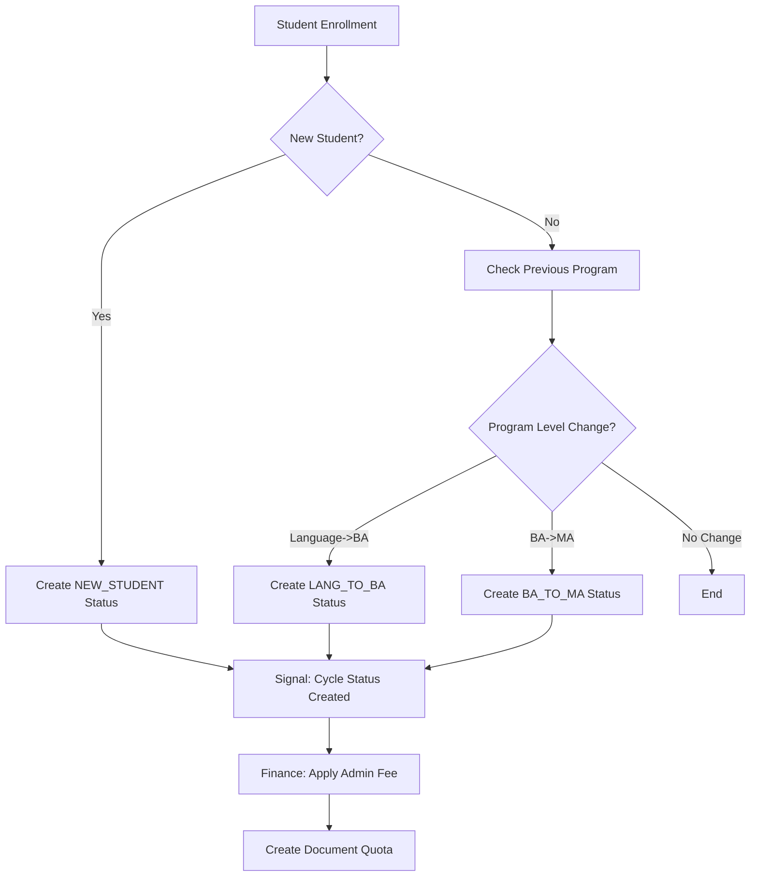
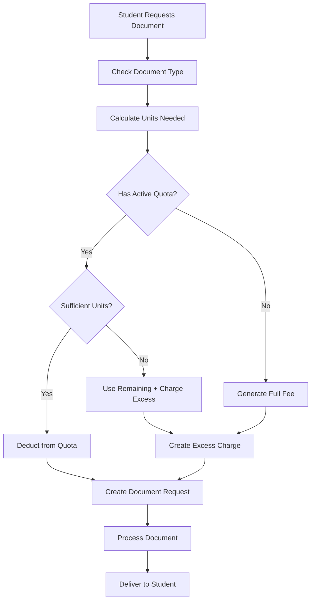
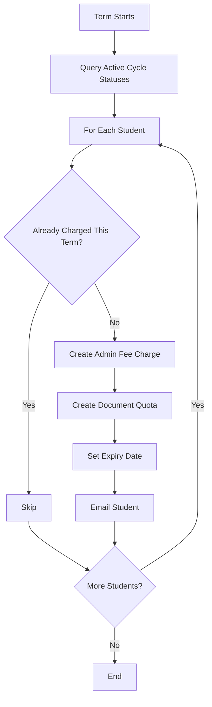

# Administrative Fee and Document Quota System - Detailed Specifications

## Executive Summary

This specification defines a system for managing administrative fees charged to students who change academic cycles (Language→BA, BA→MA) or are new students. These students pay an administrative fee each term that includes a quota of free documents. Additional documents beyond the quota incur per-unit charges.

## Table of Contents

1. [Business Requirements](#business-requirements)
2. [System Architecture](#system-architecture)
3. [Data Models](#data-models)
4. [Service Layer](#service-layer)
5. [API Specifications](#api-specifications)
6. [Workflow Diagrams](#workflow-diagrams)
7. [Implementation Plan](#implementation-plan)
8. [Testing Strategy](#testing-strategy)

## Business Requirements

### 1.1 Cycle Change Detection
- Identify students transitioning between academic levels:
  - Language Program → Bachelor's Degree (LANG_TO_BA)
  - Bachelor's Degree → Master's Degree (BA_TO_MA)
  - New Students (NEW_STUDENT)
- Track cycle change status persistently across terms until graduation

### 1.2 Administrative Fee Application
- Apply administrative fee EVERY TERM for students with active cycle change status
- Fee includes a configurable quota of document units (e.g., 10 units)
- Different document types consume different numbers of units:
  - Official Transcript: 1 unit
  - Enrollment Verification Letter: 2 units
  - Recommendation Letter: 3 units

### 1.3 Document Ordering System
- Students can request documents through web/mobile interface
- System checks available quota before processing
- Automatic fee generation for documents exceeding quota
- Track document request status and delivery

## System Architecture

### 2.1 App Responsibilities

```
┌─────────────────┐     ┌─────────────────────┐     ┌──────────────┐
│   enrollment    │     │  academic_records   │     │   finance    │
├─────────────────┤     ├─────────────────────┤     ├──────────────┤
│ • Detect cycle  │     │ • Document requests │     │ • Admin fees │
│   changes       │     │ • Quota tracking    │     │ • Per-doc    │
│ • Track status  │────▶│ • Order entry API   │────▶│   fees       │
│ • Signals       │     │ • Delivery status   │     │ • Billing    │
└─────────────────┘     └─────────────────────┘     └──────────────┘
```

### 2.2 Integration Points
- **enrollment → academic_records**: Signals for quota initialization
- **academic_records → finance**: Document requests requiring payment
- **finance → academic_records**: Payment confirmation for document release

## Data Models

### 3.1 Enrollment App Models

```python
# apps/enrollment/models.py

class StudentCycleStatus(AuditModel):
    """Tracks students who have changed academic cycles or are new."""
    
    class CycleChangeType(models.TextChoices):
        NEW_STUDENT = 'NEW', _('New Student')
        LANG_TO_BA = 'L2B', _('Language to Bachelor')
        BA_TO_MA = 'B2M', _('Bachelor to Master')
    
    student = models.ForeignKey(
        'people.StudentProfile',
        on_delete=models.PROTECT,
        related_name='cycle_statuses'
    )
    cycle_type = models.CharField(
        max_length=3,
        choices=CycleChangeType.choices,
        help_text=_("Type of cycle change")
    )
    detected_date = models.DateField(
        help_text=_("Date when cycle change was detected")
    )
    source_program = models.ForeignKey(
        'curriculum.Major',
        on_delete=models.PROTECT,
        null=True,
        blank=True,
        related_name='cycle_departures',
        help_text=_("Program student was in before change")
    )
    target_program = models.ForeignKey(
        'curriculum.Major',
        on_delete=models.PROTECT,
        related_name='cycle_arrivals',
        help_text=_("Program student changed to")
    )
    is_active = models.BooleanField(
        default=True,
        help_text=_("Active until student graduates")
    )
    deactivated_date = models.DateField(
        null=True,
        blank=True,
        help_text=_("Date when status was deactivated (graduation/withdrawal)")
    )
    
    class Meta:
        db_table = 'enrollment_student_cycle_status'
        indexes = [
            models.Index(fields=['student', 'is_active']),
            models.Index(fields=['cycle_type', 'is_active']),
            models.Index(fields=['detected_date']),
        ]
        constraints = [
            models.UniqueConstraint(
                fields=['student', 'cycle_type', 'target_program'],
                name='unique_student_cycle_program'
            )
        ]
```

### 3.2 Academic Records App Models

```python
# apps/academic_records/models.py

class DocumentQuota(AuditModel):
    """Tracks document quotas included with administrative fees."""
    
    student = models.ForeignKey(
        'people.StudentProfile',
        on_delete=models.PROTECT,
        related_name='document_quotas'
    )
    term = models.ForeignKey(
        'curriculum.Term',
        on_delete=models.PROTECT,
        related_name='document_quotas',
        help_text=_("Term this quota applies to")
    )
    cycle_status = models.ForeignKey(
        'enrollment.StudentCycleStatus',
        on_delete=models.PROTECT,
        related_name='document_quotas',
        help_text=_("Associated cycle status that triggered this quota")
    )
    
    # Quota allocation
    total_units = models.PositiveIntegerField(
        default=10,
        help_text=_("Total document units allocated for this term")
    )
    used_units = models.PositiveIntegerField(
        default=0,
        help_text=_("Document units already used")
    )
    
    # Financial link
    admin_fee_charge = models.ForeignKey(
        'finance.Charge',
        on_delete=models.PROTECT,
        null=True,
        blank=True,
        related_name='document_quotas',
        help_text=_("Administrative fee charge that included this quota")
    )
    
    # Status tracking
    is_active = models.BooleanField(
        default=True,
        help_text=_("Whether this quota is currently usable")
    )
    expires_date = models.DateField(
        help_text=_("Date when this quota expires")
    )
    
    class Meta:
        db_table = 'academic_records_document_quota'
        unique_together = [['student', 'term']]
        indexes = [
            models.Index(fields=['student', 'term', 'is_active']),
            models.Index(fields=['expires_date']),
        ]
    
    @property
    def remaining_units(self):
        """Calculate remaining document units."""
        return max(0, self.total_units - self.used_units)
    
    @property
    def is_expired(self):
        """Check if quota has expired."""
        return timezone.now().date() > self.expires_date


class DocumentQuotaUsage(AuditModel):
    """Records individual document requests against quotas."""
    
    quota = models.ForeignKey(
        DocumentQuota,
        on_delete=models.PROTECT,
        related_name='usage_records'
    )
    document_request = models.ForeignKey(
        'academic_records.DocumentRequest',
        on_delete=models.PROTECT,
        related_name='quota_usage'
    )
    units_consumed = models.PositiveIntegerField(
        help_text=_("Number of units consumed for this document")
    )
    usage_date = models.DateTimeField(
        auto_now_add=True,
        help_text=_("When the units were consumed")
    )
    
    class Meta:
        db_table = 'academic_records_document_quota_usage'
        indexes = [
            models.Index(fields=['quota', 'usage_date']),
            models.Index(fields=['document_request']),
        ]


# Update existing DocumentTypeConfig to add unit cost
class DocumentTypeConfig(models.Model):
    # ... existing fields ...
    
    # Add quota configuration
    unit_cost = models.PositiveIntegerField(
        _("Unit Cost"),
        default=1,
        help_text=_("Number of quota units required for this document type")
    )
```

### 3.3 Finance App Models

```python
# apps/finance/models.py

class AdministrativeFeeConfig(AuditModel):
    """Configuration for administrative fees by cycle type."""
    
    cycle_type = models.CharField(
        max_length=3,
        choices=[
            ('NEW', _('New Student')),
            ('L2B', _('Language to Bachelor')),
            ('B2M', _('Bachelor to Master')),
        ],
        unique=True,
        help_text=_("Type of cycle change this fee applies to")
    )
    fee_amount = models.DecimalField(
        max_digits=10,
        decimal_places=2,
        help_text=_("Administrative fee amount per term")
    )
    included_document_units = models.PositiveIntegerField(
        default=10,
        help_text=_("Number of document units included with this fee")
    )
    quota_validity_days = models.PositiveIntegerField(
        default=120,
        help_text=_("Number of days the document quota is valid")
    )
    is_active = models.BooleanField(
        default=True,
        help_text=_("Whether this fee configuration is currently active")
    )
    effective_date = models.DateField(
        help_text=_("Date when this configuration becomes effective")
    )
    
    class Meta:
        db_table = 'finance_administrative_fee_config'
        indexes = [
            models.Index(fields=['cycle_type', 'is_active']),
            models.Index(fields=['effective_date']),
        ]


class DocumentExcessFee(AuditModel):
    """Fees charged for documents exceeding quota."""
    
    charge = models.ForeignKey(
        'finance.Charge',
        on_delete=models.CASCADE,
        related_name='document_excess_fees'
    )
    document_request = models.ForeignKey(
        'academic_records.DocumentRequest',
        on_delete=models.PROTECT,
        related_name='excess_fees'
    )
    units_charged = models.PositiveIntegerField(
        help_text=_("Number of excess units charged")
    )
    unit_price = models.DecimalField(
        max_digits=10,
        decimal_places=2,
        help_text=_("Price per excess unit")
    )
    
    @property
    def total_amount(self):
        """Calculate total excess fee amount."""
        return self.units_charged * self.unit_price
    
    class Meta:
        db_table = 'finance_document_excess_fee'
        indexes = [
            models.Index(fields=['charge']),
            models.Index(fields=['document_request']),
        ]


# Extension to existing Charge model
class ChargeType(models.TextChoices):
    # ... existing types ...
    ADMINISTRATIVE_FEE = 'ADMIN_FEE', _('Administrative Fee')
    DOCUMENT_EXCESS = 'DOC_EXCESS', _('Document Excess Fee')
```

## Service Layer

### 4.1 Cycle Detection Service

```python
# apps/enrollment/services.py

from django.db import transaction
from apps.enrollment.models import StudentCycleStatus
from apps.people.models import StudentProfile
from apps.curriculum.models import Major

class CycleDetectionService:
    """Service for detecting and managing student cycle changes."""
    
    @staticmethod
    @transaction.atomic
    def detect_cycle_change(student: StudentProfile, new_program: Major) -> StudentCycleStatus | None:
        """
        Detect if a student is changing cycles based on program change.
        
        Returns:
            StudentCycleStatus if cycle change detected, None otherwise
        """
        # Check if student is new (no previous enrollments)
        if not student.course_enrollments.exists():
            return CycleDetectionService._create_new_student_status(student, new_program)
        
        # Get previous program level
        previous_enrollments = student.course_enrollments.order_by('-term__start_date')
        if not previous_enrollments:
            return None
            
        previous_program = previous_enrollments.first().section.course.program
        
        # Detect cycle changes based on program levels
        cycle_type = CycleDetectionService._determine_cycle_type(
            previous_program, new_program
        )
        
        if cycle_type:
            return CycleDetectionService._create_cycle_status(
                student, cycle_type, previous_program, new_program
            )
        
        return None
    
    @staticmethod
    def _determine_cycle_type(old_program: Major, new_program: Major) -> str | None:
        """Determine the type of cycle change based on program transition."""
        # Language to Bachelor
        if old_program.level == 'LANGUAGE' and new_program.level == 'BACHELOR':
            return StudentCycleStatus.CycleChangeType.LANG_TO_BA
        
        # Bachelor to Master
        if old_program.level == 'BACHELOR' and new_program.level == 'MASTER':
            return StudentCycleStatus.CycleChangeType.BA_TO_MA
        
        return None
    
    @staticmethod
    def _create_new_student_status(student: StudentProfile, program: Major) -> StudentCycleStatus:
        """Create status for new students."""
        return StudentCycleStatus.objects.create(
            student=student,
            cycle_type=StudentCycleStatus.CycleChangeType.NEW_STUDENT,
            detected_date=timezone.now().date(),
            target_program=program
        )
    
    @staticmethod
    def _create_cycle_status(
        student: StudentProfile,
        cycle_type: str,
        source_program: Major,
        target_program: Major
    ) -> StudentCycleStatus:
        """Create or update cycle status for student."""
        status, created = StudentCycleStatus.objects.update_or_create(
            student=student,
            cycle_type=cycle_type,
            target_program=target_program,
            defaults={
                'detected_date': timezone.now().date(),
                'source_program': source_program,
                'is_active': True
            }
        )
        return status
```

### 4.2 Administrative Fee Service

```python
# apps/finance/services.py

from django.db import transaction
from django.db.models.signals import post_save
from apps.enrollment.models import StudentCycleStatus
from apps.finance.models import AdministrativeFeeConfig, Charge
from apps.academic_records.services import DocumentQuotaService

class AdministrativeFeeService:
    """Service for managing administrative fees and document quotas."""
    
    @staticmethod
    @transaction.atomic
    def apply_administrative_fee(
        student: StudentProfile,
        term: Term,
        cycle_status: StudentCycleStatus
    ) -> tuple[Charge, DocumentQuota]:
        """
        Apply administrative fee for student with cycle change status.
        
        Returns:
            Tuple of (Charge, DocumentQuota) created
        """
        # Get fee configuration
        config = AdministrativeFeeConfig.objects.get(
            cycle_type=cycle_status.cycle_type,
            is_active=True,
            effective_date__lte=timezone.now().date()
        )
        
        # Create administrative fee charge
        charge = Charge.objects.create(
            student=student,
            term=term,
            charge_type=ChargeType.ADMINISTRATIVE_FEE,
            amount=config.fee_amount,
            description=f"Administrative Fee - {cycle_status.get_cycle_type_display()}",
            due_date=term.payment_deadline
        )
        
        # Create document quota
        quota = DocumentQuotaService.create_quota(
            student=student,
            term=term,
            cycle_status=cycle_status,
            total_units=config.included_document_units,
            validity_days=config.quota_validity_days,
            admin_fee_charge=charge
        )
        
        return charge, quota
    
    @staticmethod
    def should_charge_admin_fee(student: StudentProfile, term: Term) -> bool:
        """Check if student should be charged administrative fee for term."""
        # Check for active cycle status
        active_status = StudentCycleStatus.objects.filter(
            student=student,
            is_active=True
        ).first()
        
        if not active_status:
            return False
        
        # Check if already charged for this term
        existing_charge = Charge.objects.filter(
            student=student,
            term=term,
            charge_type=ChargeType.ADMINISTRATIVE_FEE
        ).exists()
        
        return not existing_charge
```

### 4.3 Document Quota Service

```python
# apps/academic_records/services.py

from django.db import transaction
from apps.academic_records.models import (
    DocumentQuota, DocumentQuotaUsage, DocumentRequest,
    DocumentTypeConfig
)
from apps.finance.models import Charge, DocumentExcessFee

class DocumentQuotaService:
    """Service for managing document quotas and usage."""
    
    @staticmethod
    def create_quota(
        student: StudentProfile,
        term: Term,
        cycle_status: StudentCycleStatus,
        total_units: int,
        validity_days: int,
        admin_fee_charge: Charge
    ) -> DocumentQuota:
        """Create document quota for student."""
        expires_date = timezone.now().date() + timedelta(days=validity_days)
        
        quota = DocumentQuota.objects.create(
            student=student,
            term=term,
            cycle_status=cycle_status,
            total_units=total_units,
            used_units=0,
            admin_fee_charge=admin_fee_charge,
            is_active=True,
            expires_date=expires_date
        )
        
        return quota
    
    @staticmethod
    @transaction.atomic
    def process_document_request(
        student: StudentProfile,
        document_type: DocumentTypeConfig,
        term: Term,
        **request_data
    ) -> tuple[DocumentRequest, Charge | None]:
        """
        Process document request, checking quota and creating charges if needed.
        
        Returns:
            Tuple of (DocumentRequest, Charge or None)
        """
        # Get active quota for student
        quota = DocumentQuota.objects.filter(
            student=student,
            term=term,
            is_active=True,
            expires_date__gte=timezone.now().date()
        ).first()
        
        units_needed = document_type.unit_cost
        excess_charge = None
        
        if quota and quota.remaining_units >= units_needed:
            # Use quota
            DocumentQuotaUsage.objects.create(
                quota=quota,
                units_consumed=units_needed,
                # document_request will be linked after creation
            )
            quota.used_units += units_needed
            quota.save()
            
            # Update request data to indicate quota usage
            request_data['is_free_allowance'] = True
            request_data['payment_required'] = False
            request_data['payment_status'] = 'NOT_REQUIRED'
        else:
            # Calculate excess units
            if quota and quota.remaining_units > 0:
                # Partial quota usage
                quota_units = quota.remaining_units
                excess_units = units_needed - quota_units
                
                # Use remaining quota
                DocumentQuotaUsage.objects.create(
                    quota=quota,
                    units_consumed=quota_units
                )
                quota.used_units = quota.total_units
                quota.save()
            else:
                # No quota available
                excess_units = units_needed
            
            # Create excess charge
            if excess_units > 0:
                excess_charge = DocumentQuotaService._create_excess_charge(
                    student, term, document_type, excess_units
                )
                
                request_data['has_fee'] = True
                request_data['fee_amount'] = excess_charge.amount
                request_data['payment_required'] = True
                request_data['payment_status'] = 'PENDING'
                request_data['finance_invoice_id'] = excess_charge.id
        
        # Create document request
        document_request = DocumentRequest.objects.create(
            student=student,
            document_type=document_type,
            **request_data
        )
        
        # Link quota usage to document request
        if quota:
            DocumentQuotaUsage.objects.filter(
                quota=quota,
                document_request__isnull=True
            ).update(document_request=document_request)
        
        # Link excess fee to document request
        if excess_charge:
            DocumentExcessFee.objects.create(
                charge=excess_charge,
                document_request=document_request,
                units_charged=excess_units,
                unit_price=document_type.fee_amount / document_type.unit_cost
            )
        
        return document_request, excess_charge
    
    @staticmethod
    def _create_excess_charge(
        student: StudentProfile,
        term: Term,
        document_type: DocumentTypeConfig,
        excess_units: int
    ) -> Charge:
        """Create charge for excess document units."""
        unit_price = document_type.fee_amount / document_type.unit_cost
        total_amount = excess_units * unit_price
        
        charge = Charge.objects.create(
            student=student,
            term=term,
            charge_type=ChargeType.DOCUMENT_EXCESS,
            amount=total_amount,
            description=f"Excess Document Fee - {document_type.name} ({excess_units} units)",
            due_date=timezone.now().date() + timedelta(days=7)
        )
        
        return charge
    
    @staticmethod
    def get_quota_summary(student: StudentProfile, term: Term) -> dict:
        """Get summary of student's document quota for a term."""
        quota = DocumentQuota.objects.filter(
            student=student,
            term=term,
            is_active=True
        ).first()
        
        if not quota:
            return {
                'has_quota': False,
                'total_units': 0,
                'used_units': 0,
                'remaining_units': 0,
                'expires_date': None,
                'is_expired': True
            }
        
        return {
            'has_quota': True,
            'total_units': quota.total_units,
            'used_units': quota.used_units,
            'remaining_units': quota.remaining_units,
            'expires_date': quota.expires_date,
            'is_expired': quota.is_expired,
            'usage_history': list(
                quota.usage_records.select_related('document_request__document_type')
                .values(
                    'usage_date',
                    'units_consumed',
                    'document_request__document_type__name'
                )
            )
        }
```

## API Specifications

### 5.1 Document Request API

```python
# apps/academic_records/api.py

from ninja import Router, Schema
from typing import Optional
from datetime import date
from apps.academic_records.services import DocumentQuotaService
from apps.academic_records.models import DocumentTypeConfig, DocumentRequest

router = Router()

# Schemas
class DocumentTypeOut(Schema):
    code: str
    name: str
    category: str
    unit_cost: int
    fee_amount: float | None
    processing_time_hours: int
    available_delivery_methods: list[str]

class QuotaSummaryOut(Schema):
    has_quota: bool
    total_units: int
    used_units: int
    remaining_units: int
    expires_date: date | None
    is_expired: bool
    usage_history: list[dict]

class DocumentRequestIn(Schema):
    document_type_code: str
    delivery_method: str
    recipient_email: str | None = None
    recipient_name: str | None = None
    recipient_address: str | None = None
    request_notes: str | None = None
    custom_data: dict | None = None

class DocumentRequestOut(Schema):
    request_id: str
    document_type: DocumentTypeOut
    request_status: str
    delivery_method: str
    has_fee: bool
    fee_amount: float | None
    is_free_allowance: bool
    payment_required: bool
    payment_status: str
    requested_date: str
    due_date: str | None

class FeeCalculationOut(Schema):
    requires_payment: bool
    fee_amount: float
    units_needed: int
    quota_units_available: int
    excess_units: int
    message: str

# Endpoints
@router.get("/document-types", response=list[DocumentTypeOut])
def list_document_types(request):
    """List all available document types."""
    types = DocumentTypeConfig.objects.filter(is_active=True).order_by('display_order')
    return types

@router.get("/quota-summary", response=QuotaSummaryOut)
def get_quota_summary(request):
    """Get current document quota summary for logged-in student."""
    student = request.user.student_profile
    current_term = get_current_term()  # Utility function
    return DocumentQuotaService.get_quota_summary(student, current_term)

@router.post("/calculate-fee", response=FeeCalculationOut)
def calculate_document_fee(request, document_type_code: str):
    """Calculate fee for a specific document type."""
    student = request.user.student_profile
    current_term = get_current_term()
    
    document_type = get_object_or_404(
        DocumentTypeConfig,
        code=document_type_code,
        is_active=True
    )
    
    # Get quota information
    quota = DocumentQuota.objects.filter(
        student=student,
        term=current_term,
        is_active=True,
        expires_date__gte=timezone.now().date()
    ).first()
    
    units_needed = document_type.unit_cost
    quota_available = quota.remaining_units if quota else 0
    
    if quota_available >= units_needed:
        return FeeCalculationOut(
            requires_payment=False,
            fee_amount=0,
            units_needed=units_needed,
            quota_units_available=quota_available,
            excess_units=0,
            message=f"This document will use {units_needed} of your {quota_available} available units."
        )
    else:
        excess_units = units_needed - quota_available
        unit_price = document_type.fee_amount / document_type.unit_cost
        fee_amount = excess_units * unit_price
        
        return FeeCalculationOut(
            requires_payment=True,
            fee_amount=fee_amount,
            units_needed=units_needed,
            quota_units_available=quota_available,
            excess_units=excess_units,
            message=f"You need {excess_units} additional units. Fee: ${fee_amount:.2f}"
        )

@router.post("/request-document", response=DocumentRequestOut)
def request_document(request, data: DocumentRequestIn):
    """Submit a new document request."""
    student = request.user.student_profile
    current_term = get_current_term()
    
    document_type = get_object_or_404(
        DocumentTypeConfig,
        code=data.document_type_code,
        is_active=True
    )
    
    # Process the request
    document_request, charge = DocumentQuotaService.process_document_request(
        student=student,
        document_type=document_type,
        term=current_term,
        delivery_method=data.delivery_method,
        recipient_email=data.recipient_email,
        recipient_name=data.recipient_name,
        recipient_address=data.recipient_address,
        request_notes=data.request_notes,
        custom_data=data.custom_data or {},
        requested_by=request.user
    )
    
    return document_request

@router.get("/my-requests", response=list[DocumentRequestOut])
def list_my_requests(request):
    """List all document requests for logged-in student."""
    student = request.user.student_profile
    requests = DocumentRequest.objects.filter(
        student=student
    ).select_related('document_type').order_by('-requested_date')
    
    return requests
```

### 5.2 Administrative Dashboard API

```python
# apps/enrollment/api.py

from ninja import Router, Schema
from apps.enrollment.models import StudentCycleStatus
from apps.finance.models import AdministrativeFeeConfig

router = Router()

# Schemas
class CycleStatusOut(Schema):
    student_id: str
    student_name: str
    cycle_type: str
    cycle_type_display: str
    detected_date: date
    source_program: str | None
    target_program: str
    is_active: bool

class AdminFeeConfigOut(Schema):
    cycle_type: str
    cycle_type_display: str
    fee_amount: float
    included_document_units: int
    quota_validity_days: int
    is_active: bool
    effective_date: date

# Endpoints
@router.get("/cycle-statuses", response=list[CycleStatusOut])
def list_cycle_statuses(request, active_only: bool = True):
    """List students with cycle change status."""
    queryset = StudentCycleStatus.objects.select_related(
        'student__person',
        'source_program',
        'target_program'
    )
    
    if active_only:
        queryset = queryset.filter(is_active=True)
    
    return [{
        'student_id': status.student.student_id,
        'student_name': status.student.person.get_full_name(),
        'cycle_type': status.cycle_type,
        'cycle_type_display': status.get_cycle_type_display(),
        'detected_date': status.detected_date,
        'source_program': status.source_program.name if status.source_program else None,
        'target_program': status.target_program.name,
        'is_active': status.is_active
    } for status in queryset]

@router.get("/admin-fee-configs", response=list[AdminFeeConfigOut])
def list_admin_fee_configs(request):
    """List administrative fee configurations."""
    configs = AdministrativeFeeConfig.objects.all().order_by('cycle_type')
    
    return [{
        'cycle_type': config.cycle_type,
        'cycle_type_display': dict(AdministrativeFeeConfig._meta.get_field('cycle_type').choices)[config.cycle_type],
        'fee_amount': config.fee_amount,
        'included_document_units': config.included_document_units,
        'quota_validity_days': config.quota_validity_days,
        'is_active': config.is_active,
        'effective_date': config.effective_date
    } for config in configs]

@router.post("/detect-cycle-changes")
def detect_cycle_changes_batch(request):
    """Manually trigger cycle change detection for recent enrollments."""
    # Implementation for batch detection
    # This would be called periodically or after bulk enrollment
    pass
```

### 5.3 Finance Integration API

```python
# apps/finance/api.py

from ninja import Router, Schema
from apps.finance.services import AdministrativeFeeService

router = Router()

# Schemas
class AdminFeeApplicationOut(Schema):
    charge_id: int
    student_id: str
    student_name: str
    term: str
    fee_amount: float
    quota_units: int
    status: str
    created_date: str

# Endpoints
@router.post("/apply-admin-fees")
def apply_administrative_fees(request, term_id: int):
    """Apply administrative fees for all eligible students in a term."""
    term = get_object_or_404(Term, id=term_id)
    
    # Get all students with active cycle status
    active_statuses = StudentCycleStatus.objects.filter(
        is_active=True
    ).select_related('student')
    
    results = []
    for status in active_statuses:
        if AdministrativeFeeService.should_charge_admin_fee(status.student, term):
            try:
                charge, quota = AdministrativeFeeService.apply_administrative_fee(
                    student=status.student,
                    term=term,
                    cycle_status=status
                )
                
                results.append({
                    'charge_id': charge.id,
                    'student_id': status.student.student_id,
                    'student_name': status.student.person.get_full_name(),
                    'term': str(term),
                    'fee_amount': charge.amount,
                    'quota_units': quota.total_units,
                    'status': 'SUCCESS',
                    'created_date': charge.created_at.isoformat()
                })
            except Exception as e:
                results.append({
                    'student_id': status.student.student_id,
                    'student_name': status.student.person.get_full_name(),
                    'term': str(term),
                    'status': 'ERROR',
                    'error': str(e)
                })
    
    return {'applied_count': len([r for r in results if r.get('status') == 'SUCCESS']), 'results': results}
```

## Workflow Diagrams

### 6.1 Cycle Change Detection Flow



### 6.2 Document Request Flow



### 6.3 Administrative Fee Billing Flow



## Implementation Plan

### 7.1 Phase 1: Foundation (Week 1-2)
1. **Database Models**
   - Create migrations for all new models
   - Add indexes for performance
   - Create initial data fixtures
   
2. **Service Layer**
   - Implement CycleDetectionService
   - Implement AdministrativeFeeService
   - Implement DocumentQuotaService
   
3. **Testing**
   - Unit tests for all services
   - Integration tests for workflows

### 7.2 Phase 2: APIs and Integration (Week 3-4)
1. **API Development**
   - Implement all API endpoints
   - Add authentication and permissions
   - Create API documentation
   
2. **Signal Integration**
   - Connect enrollment signals to cycle detection
   - Connect cycle detection to fee generation
   - Add audit logging
   
3. **Admin Interface**
   - Django admin customization
   - Bulk operations support
   - Reporting views

### 7.3 Phase 3: Frontend Integration (Week 5-6)
1. **Student Portal**
   - Document request interface
   - Quota dashboard
   - Payment integration
   
2. **Staff Portal**
   - Cycle status management
   - Fee configuration
   - Document processing workflow
   
3. **Mobile Support**
   - Responsive design
   - Mobile app API support

### 7.4 Phase 4: Testing and Deployment (Week 7-8)
1. **Comprehensive Testing**
   - End-to-end testing
   - Performance testing
   - Security audit
   
2. **Data Migration**
   - Identify existing cycle-change students
   - Create initial statuses
   - Generate quotas for current term
   
3. **Deployment**
   - Staging deployment
   - User training
   - Production rollout

## Testing Strategy

### 8.1 Unit Tests
```python
# Test cycle detection
def test_new_student_detection():
    student = create_test_student()
    program = create_test_program(level='BACHELOR')
    
    status = CycleDetectionService.detect_cycle_change(student, program)
    
    assert status.cycle_type == StudentCycleStatus.CycleChangeType.NEW_STUDENT
    assert status.target_program == program
    assert status.is_active

# Test quota calculation
def test_document_quota_usage():
    quota = create_test_quota(total_units=10, used_units=3)
    document_type = create_test_document_type(unit_cost=5)
    
    result = DocumentQuotaService.calculate_fee(
        quota.student,
        document_type
    )
    
    assert result['is_free_allowance'] == True
    assert result['remaining_units'] == 2  # 7 - 5
```

### 8.2 Integration Tests
- Test complete enrollment → cycle detection → fee generation flow
- Test document request → quota check → charge creation flow
- Test payment → document release flow

### 8.3 Performance Tests
- Load test with 1000+ concurrent document requests
- Stress test quota calculation with complex scenarios
- Database query optimization validation

## Security Considerations

1. **Access Control**
   - Students can only view/request their own documents
   - Staff permissions for fee configuration
   - Audit trail for all financial transactions

2. **Data Protection**
   - Encrypt sensitive document data
   - Secure document storage and delivery
   - GDPR compliance for data retention

3. **Financial Security**
   - Payment validation before document release
   - Reconciliation reports
   - Fraud detection for unusual patterns

## Future Enhancements

1. **Advanced Features**
   - Bulk document requests
   - Document templates customization
   - Express processing options
   
2. **Analytics**
   - Document request patterns
   - Revenue forecasting
   - Student behavior insights
   
3. **Integration**
   - Third-party document verification
   - Blockchain verification
   - International document apostille

<function_calls>
<invoke name="TodoWrite">
<parameter name="todos">[{"id": "1", "content": "Write detailed specifications for administrative fee and document quota system", "status": "in_progress", "priority": "high"}, {"id": "2", "content": "Define models for enrollment app (cycle tracking)", "status": "completed", "priority": "high"}, {"id": "3", "content": "Define models for academic_records app (quota tracking)", "status": "in_progress", "priority": "high"}, {"id": "4", "content": "Define models for finance app (fee configuration)", "status": "pending", "priority": "high"}, {"id": "5", "content": "Define service layer interactions", "status": "pending", "priority": "high"}, {"id": "6", "content": "Define API specifications", "status": "pending", "priority": "high"}, {"id": "7", "content": "Define implementation phases and timeline", "status": "pending", "priority": "medium"}]