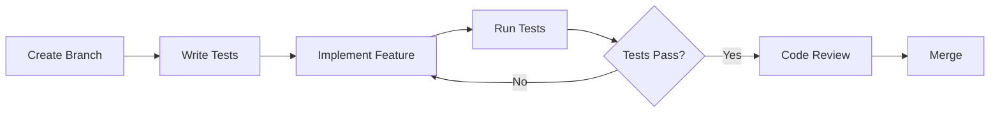

# Developer Onboarding Guide

Welcome to the Naga Student Information System development team! This guide will help you get up and running with the project quickly and effectively.

## Table of Contents

1. [Welcome](#welcome)
2. [Development Environment Setup](#development-environment-setup)
3. [Project Architecture Overview](#project-architecture-overview)
4. [Development Workflow](#development-workflow)
5. [Coding Standards](#coding-standards)
6. [Testing Guidelines](#testing-guidelines)
7. [Common Tasks](#common-tasks)
8. [Troubleshooting](#troubleshooting)
9. [Resources](#resources)

## Welcome

### Project Overview

The Naga SIS is a comprehensive student information system built with:
- **Backend**: Django 5.2+ with django-ninja API
- **Frontend**: Vue 3 + Quasar PWA
- **Database**: PostgreSQL 16
- **Architecture**: Clean architecture with strict separation of concerns

### Key Principles

1. **Clean Architecture**: Maintain clear boundaries between layers
2. **No Circular Dependencies**: Apps depend only on lower layers
3. **Test-Driven Development**: Write tests first for complex features
4. **Documentation**: Document as you code
5. **Security First**: Never compromise on security

## Development Environment Setup

### 1. Prerequisites Installation

#### macOS
```bash
# Install Homebrew
/bin/bash -c "$(curl -fsSL https://raw.githubusercontent.com/Homebrew/install/HEAD/install.sh)"

# Install required tools
brew install python@3.13.7 node@22 postgresql@17 redis git docker

# Install uv (Python package manager)
curl -LsSf https://astral.sh/uv/install.sh | sh
```

#### Ubuntu/Debian
```bash
# Update package list
sudo apt-get update

# Install required tools
sudo apt-get install -y python3.13.7 python3.13.7-venv nodejs npm postgresql-16 redis-server git docker.io docker-compose

# Install uv
curl -LsSf https://astral.sh/uv/install.sh | sh
```

#### Windows (WSL2)
```bash
# Install WSL2 and Ubuntu
wsl --install

# Follow Ubuntu instructions above
```

### 2. Repository Setup

```bash
# Clone the repository
git clone https://github.com/naga-sis/naga-monorepo.git
cd naga-monorepo

# Add upstream remote for updates
git remote add upstream https://github.com/naga-sis/naga-monorepo.git

# Create your feature branch
git checkout -b feature/your-name-initial-setup
```

### 3. Backend Setup

```bash
cd backend

# Create Python virtual environment with uv
uv venv
source .venv/bin/activate  # On Windows: .venv\Scripts\activate

# Install dependencies
uv sync --extra dev

# Copy environment template
cp .env.example .env.local
# Edit .env.local with your settings

# Start Docker services
docker compose -f docker-compose.local.yml up -d

# Wait for services to be ready
sleep 10

# Run migrations
docker compose -f docker-compose.local.yml exec django python manage.py migrate

# Create superuser
docker compose -f docker-compose.local.yml exec django python manage.py createsuperuser

# Load initial data
docker compose -f docker-compose.local.yml exec django python manage.py loaddata initial_data
```

### 4. Frontend Setup

```bash
cd ../frontend

# Install dependencies
npm install

# Copy environment template
cp .env.example .env.local
# Edit .env.local with your API URL

# Start development server
npm run dev

# Open http://localhost:3000
```

### 5. IDE Setup

#### VS Code (Recommended)

Install extensions:
```bash
code --install-extension ms-python.python
code --install-extension ms-python.vscode-pylance
code --install-extension ms-python.black-formatter
code --install-extension charliermarsh.ruff
code --install-extension Vue.volar
code --install-extension dbaeumer.vscode-eslint
code --install-extension esbenp.prettier-vscode
```

**Workspace settings (.vscode/settings.json)**:
```json
{
  "python.linting.enabled": true,
  "python.linting.ruffEnabled": true,
  "python.formatting.provider": "black",
  "editor.formatOnSave": true,
  "editor.codeActionsOnSave": {
    "source.organizeImports": true
  },
  "[python]": {
    "editor.defaultFormatter": "ms-python.black-formatter"
  },
  "[vue]": {
    "editor.defaultFormatter": "esbenp.prettier-vscode"
  },
  "python.testing.pytestEnabled": true,
  "python.testing.unittestEnabled": false
}
```

#### PyCharm

1. Open project as Python project
2. Configure Python interpreter: `.venv/bin/python`
3. Enable Django support: Settings → Languages & Frameworks → Django
4. Set Django settings module: `config.settings.local`
5. Configure Node.js: Settings → Languages & Frameworks → Node.js

### 6. Verify Installation

```bash
# Backend tests
cd backend
uv run pytest

# Frontend tests
cd ../frontend
npm run test

# Check code quality
cd ../backend
uv run ruff check .
uv run mypy .

cd ../frontend
npm run lint
npm run type-check
```

## Project Architecture Overview

### Clean Architecture Layers

```
┌─────────────────────────────────────┐
│         Presentation Layer          │  ← Django Views, API Endpoints
├─────────────────────────────────────┤
│         Application Layer           │  ← Use Cases, Services
├─────────────────────────────────────┤
│           Domain Layer              │  ← Models, Business Logic
├─────────────────────────────────────┤
│       Infrastructure Layer          │  ← Database, External Services
└─────────────────────────────────────┘
```

### Django Apps Organization

**Foundation Layer** (No dependencies):
- `common/` - Utilities, base models
- `accounts/` - Authentication
- `geography/` - Locations
- `facilities/` - Buildings, rooms

**Domain Layer** (Depends on Foundation):
- `people/` - Students, staff
- `curriculum/` - Courses, programs
- `academic/` - Requirements
- `scheduling/` - Class schedules

**Business Logic Layer** (Depends on Domain + Foundation):
- `enrollment/` - Registration
- `finance/` - Billing, payments
- `grading/` - Grades, GPA
- `attendance/` - Attendance tracking

**Service Layer** (Depends on all lower layers):
- `documents/` - Document generation
- `workflow/` - Process automation
- `mobile/` - Mobile APIs

### Key Design Patterns

1. **Service Pattern**
```python
# Good: Use service classes for business logic
from apps.enrollment.services import EnrollmentService

class CourseRegistration:
    def register(self, student_id: str, course_id: str):
        return EnrollmentService.create_enrollment(student_id, course_id)
```

2. **Repository Pattern**
```python
# Good: Abstract database access
class StudentRepository:
    def get_active_students(self):
        return Person.objects.filter(is_student=True, status='active')
```

3. **Factory Pattern**
```python
# Good: Centralize object creation
class InvoiceFactory:
    @staticmethod
    def create_tuition_invoice(enrollment):
        # Complex invoice creation logic
        pass
```

## Development Workflow

### 1. Starting New Feature

```bash
# Update main branch
git checkout main
git pull upstream main

# Create feature branch
git checkout -b feature/module-name-description

# Example: feature/enrollment-add-waitlist-support
```

### 2. Development Process



### 3. Commit Guidelines

Use conventional commits:
```bash
# Format: <type>(<scope>): <subject>

# Examples:
git commit -m "feat(enrollment): add waitlist support"
git commit -m "fix(finance): correct invoice calculation"
git commit -m "docs(api): update enrollment endpoints"
git commit -m "test(grading): add GPA calculation tests"
git commit -m "refactor(people): simplify person model"
```

**Types**:
- `feat`: New feature
- `fix`: Bug fix
- `docs`: Documentation
- `style`: Formatting
- `refactor`: Code restructuring
- `test`: Adding tests
- `chore`: Maintenance

### 4. Pull Request Process

1. **Create PR with template**:
```markdown
## Description
Brief description of changes

## Type of Change
- [ ] Bug fix
- [ ] New feature
- [ ] Breaking change
- [ ] Documentation update

## Testing
- [ ] Unit tests pass
- [ ] Integration tests pass
- [ ] Manual testing completed

## Checklist
- [ ] Code follows style guidelines
- [ ] Self-review completed
- [ ] Comments added for complex code
- [ ] Documentation updated
- [ ] No new warnings
```

2. **Request Review**: Tag relevant team members
3. **Address Feedback**: Make requested changes
4. **Merge**: After approval and CI passes

## Coding Standards

### Python (Backend)

**Style Guide**: PEP 8 with Ruff
```python
# Good: Clear, typed, documented
from typing import List, Optional
from django.db import models

class StudentService:
    """Service for student-related operations."""
    
    def enroll_in_course(
        self, 
        student_id: int, 
        course_id: int,
        term_id: Optional[int] = None
    ) -> Enrollment:
        """
        Enroll a student in a course.
        
        Args:
            student_id: The student's database ID
            course_id: The course's database ID
            term_id: Optional term ID, defaults to current term
            
        Returns:
            The created Enrollment instance
            
        Raises:
            ValidationError: If enrollment rules are violated
        """
        # Implementation here
        pass
```

**Django Best Practices**:
```python
# Good: Use Django's built-in features
class Student(models.Model):
    class Meta:
        verbose_name = "Student"
        verbose_name_plural = "Students"
        ordering = ['last_name', 'first_name']
        indexes = [
            models.Index(fields=['student_id']),
            models.Index(fields=['email']),
        ]

# Good: Use model methods for business logic
    def calculate_gpa(self) -> float:
        """Calculate student's current GPA."""
        return self.grades.aggregate(
            gpa=models.Avg('points')
        )['gpa'] or 0.0

# Good: Use properties for computed fields
    @property
    def full_name(self) -> str:
        return f"{self.first_name} {self.last_name}"
```

### JavaScript/TypeScript (Frontend)

**Vue 3 Composition API**:
```typescript
// Good: Typed, composable, reactive
import { ref, computed, onMounted } from 'vue'
import { useQuasar } from 'quasar'
import type { Student } from '@/types'

export default defineComponent({
  name: 'StudentList',
  
  setup() {
    const $q = useQuasar()
    const students = ref<Student[]>([])
    const loading = ref(false)
    
    const activeStudents = computed(() => 
      students.value.filter(s => s.status === 'active')
    )
    
    const loadStudents = async () => {
      loading.value = true
      try {
        students.value = await api.students.list()
      } catch (error) {
        $q.notify({
          type: 'negative',
          message: 'Failed to load students'
        })
      } finally {
        loading.value = false
      }
    }
    
    onMounted(() => {
      loadStudents()
    })
    
    return {
      students,
      loading,
      activeStudents,
      loadStudents
    }
  }
})
```

### API Design

**RESTful Endpoints**:
```python
# Good: Clear, consistent, documented
@router.get("/students/", response=List[StudentSchema])
def list_students(
    request,
    status: Optional[str] = Query(None, description="Filter by status"),
    program: Optional[int] = Query(None, description="Filter by program ID"),
    page: int = Query(1, ge=1),
    per_page: int = Query(20, ge=1, le=100)
):
    """
    List students with optional filters.
    
    Supports pagination and filtering by status and program.
    """
    queryset = Student.objects.all()
    
    if status:
        queryset = queryset.filter(status=status)
    if program:
        queryset = queryset.filter(program_id=program)
        
    return paginate(queryset, page, per_page)
```

## Testing Guidelines

### Test Structure

```
tests/
├── unit/           # Fast, isolated tests
├── integration/    # Component interaction tests
├── e2e/           # Full workflow tests
└── fixtures/      # Test data
```

### Writing Tests

**Unit Test Example**:
```python
# tests/unit/test_gpa_calculation.py
import pytest
from decimal import Decimal
from apps.grading.services import GPACalculator

class TestGPACalculator:
    """Test GPA calculation logic."""
    
    @pytest.fixture
    def calculator(self):
        return GPACalculator()
    
    def test_calculate_gpa_standard_grades(self, calculator):
        """Test GPA calculation with standard letter grades."""
        grades = [
            {'grade': 'A', 'credits': 3},   # 4.0 * 3 = 12.0
            {'grade': 'B+', 'credits': 4},  # 3.5 * 4 = 14.0
            {'grade': 'B', 'credits': 3},   # 3.0 * 3 = 9.0
        ]
        
        result = calculator.calculate(grades)
        
        # (12.0 + 14.0 + 9.0) / 10 = 3.5
        assert result == Decimal('3.50')
    
    def test_calculate_gpa_no_grades(self, calculator):
        """Test GPA calculation with no grades."""
        assert calculator.calculate([]) == Decimal('0.00')
    
    @pytest.mark.parametrize("grade,expected", [
        ('A', Decimal('4.0')),
        ('A-', Decimal('3.7')),
        ('B+', Decimal('3.3')),
        ('F', Decimal('0.0')),
    ])
    def test_grade_to_points_conversion(self, calculator, grade, expected):
        """Test individual grade to points conversion."""
        assert calculator.grade_to_points(grade) == expected
```

**Integration Test Example**:
```python
# tests/integration/test_enrollment_workflow.py
import pytest
from django.test import TestCase
from apps.enrollment.services import EnrollmentService
from apps.finance.services import BillingService

class TestEnrollmentWorkflow(TestCase):
    """Test complete enrollment workflow."""
    
    def setUp(self):
        self.student = StudentFactory()
        self.course = CourseFactory(capacity=30)
        self.term = TermFactory(status='active')
    
    def test_successful_enrollment_creates_invoice(self):
        """Test that enrollment creates corresponding invoice."""
        # Enroll student
        enrollment = EnrollmentService.enroll(
            student=self.student,
            course=self.course,
            term=self.term
        )
        
        # Check enrollment created
        assert enrollment.status == 'enrolled'
        
        # Check invoice created
        invoice = enrollment.invoices.first()
        assert invoice is not None
        assert invoice.amount == self.course.tuition_amount
        assert invoice.status == 'pending'
    
    def test_enrollment_capacity_check(self):
        """Test enrollment respects course capacity."""
        # Fill course to capacity
        StudentFactory.create_batch(30, enrolled_courses=[self.course])
        
        # Attempt to enroll one more
        with pytest.raises(ValidationError) as exc:
            EnrollmentService.enroll(
                student=self.student,
                course=self.course,
                term=self.term
            )
        
        assert 'Course is full' in str(exc.value)
```

### Running Tests

```bash
# Backend tests
cd backend

# Run all tests
uv run pytest

# Run specific test file
uv run pytest tests/unit/test_gpa_calculation.py

# Run with coverage
uv run pytest --cov=apps --cov-report=html

# Run only marked tests
uv run pytest -m "not slow"

# Frontend tests
cd ../frontend

# Run all tests
npm run test

# Run in watch mode
npm run test:watch

# Run with coverage
npm run test:coverage
```

## Common Tasks

### 1. Adding a New Django App

```bash
# Create app structure
cd backend/apps
mkdir new_feature
cd new_feature

# Create standard files
touch __init__.py models.py services.py api.py admin.py tests.py

# Add to INSTALLED_APPS in settings/base.py
# 'apps.new_feature',

# Create migrations
docker compose exec django python manage.py makemigrations new_feature
```

### 2. Adding a New API Endpoint

```python
# apps/new_feature/api.py
from ninja import Router
from typing import List
from .schemas import FeatureSchema, FeatureCreateSchema
from .services import FeatureService

router = Router()

@router.post("/", response=FeatureSchema)
def create_feature(request, data: FeatureCreateSchema):
    """Create a new feature."""
    return FeatureService.create(data.dict())

@router.get("/", response=List[FeatureSchema])
def list_features(request):
    """List all features."""
    return FeatureService.list_all()

# Add to config/api.py
# from apps.new_feature.api import router as new_feature_router
# api.add_router("/new-feature/", new_feature_router)
```

### 3. Database Migrations

```bash
# Create migration
docker compose exec django python manage.py makemigrations app_name -n descriptive_name

# Review migration
cat apps/app_name/migrations/0001_descriptive_name.py

# Apply migration
docker compose exec django python manage.py migrate

# Rollback migration
docker compose exec django python manage.py migrate app_name 0001
```

### 4. Debugging

**Backend Debugging**:
```python
# Add breakpoint in code
import pdb; pdb.set_trace()

# Or use ipdb for better experience
import ipdb; ipdb.set_trace()

# Run with debugger
docker compose exec django python manage.py runserver_plus

# Django shell
docker compose exec django python manage.py shell_plus
```

**Frontend Debugging**:
```javascript
// Vue Devtools - Install browser extension

// Add debugger statement
debugger;

// Console logging with context
console.log('Component state:', {
  students: this.students,
  loading: this.loading
})

// Vue 3 debugging
import { toRaw } from 'vue'
console.log('Raw state:', toRaw(state))
```

### 5. Performance Profiling

```python
# Django Debug Toolbar (auto-enabled in development)
# Visit http://localhost:8000/__debug__/

# Profile specific code
import cProfile
import pstats

profiler = cProfile.Profile()
profiler.enable()

# Code to profile
expensive_operation()

profiler.disable()
stats = pstats.Stats(profiler)
stats.sort_stats('cumulative')
stats.print_stats(10)  # Top 10 functions
```

## Troubleshooting

### Common Issues

#### 1. Docker Issues

**Problem**: Services won't start
```bash
# Check logs
docker compose logs django
docker compose logs postgres

# Restart services
docker compose down
docker compose up -d

# Clean restart
docker compose down -v  # Warning: Removes volumes
docker compose up -d
```

#### 2. Database Issues

**Problem**: Migration conflicts
```bash
# Check migration status
docker compose exec django python manage.py showmigrations

# Fake migration if needed
docker compose exec django python manage.py migrate app_name 0001 --fake

# Reset app migrations (development only!)
docker compose exec django python manage.py migrate app_name zero
```

#### 3. Import Errors

**Problem**: Circular imports
```python
# Bad: Direct import causes circular dependency
from apps.finance.models import Invoice

# Good: Import inside method
def process_enrollment(self):
    from apps.finance.models import Invoice
    Invoice.objects.create(...)

# Better: Use service layer
from apps.finance.services import InvoiceService
InvoiceService.create_for_enrollment(...)
```

#### 4. Frontend Build Issues

**Problem**: Dependencies not found
```bash
# Clear cache and reinstall
rm -rf node_modules package-lock.json
npm install

# Clear Vite cache
rm -rf node_modules/.vite
npm run dev
```

### Getting Help

1. **Check Documentation**:
   - Project docs: `/docs/`
   - Django docs: https://docs.djangoproject.com/
   - Vue docs: https://vuejs.org/
   - Quasar docs: https://quasar.dev/

2. **Search Existing Issues**:
   ```bash
   # Search in codebase
   git grep "search term"
   
   # Search in GitHub issues
   https://github.com/naga-sis/naga-monorepo/issues
   ```

3. **Ask Team**:
   - Slack: #naga-dev channel
   - Weekly dev meetings
   - Pair programming sessions

## Resources

### Internal Resources

- [Architecture Documentation](./ARCHITECTURE.md)
- [API Documentation](./API_DOCUMENTATION.md)
- [Deployment Guide](./DEPLOYMENT_GUIDE.md)
- [Project Wiki](https://github.com/naga-sis/naga-monorepo/wiki)

### External Resources

**Backend**:
- [Django Documentation](https://docs.djangoproject.com/)
- [django-ninja Documentation](https://django-ninja.rest-framework.com/)
- [PostgreSQL Documentation](https://www.postgresql.org/docs/)

**Frontend**:
- [Vue 3 Documentation](https://vuejs.org/)
- [Quasar Framework](https://quasar.dev/)
- [TypeScript Handbook](https://www.typescriptlang.org/docs/)

**Tools**:
- [Docker Documentation](https://docs.docker.com/)
- [Git Documentation](https://git-scm.com/doc)
- [VS Code Python](https://code.visualstudio.com/docs/python/python-tutorial)

### Learning Path

1. **Week 1**: Environment setup, run existing code
2. **Week 2**: Understand architecture, fix simple bugs
3. **Week 3**: Add small features with guidance
4. **Week 4**: Take on medium-sized features
5. **Month 2**: Lead feature development
6. **Month 3**: Mentor other developers

### Code Review Checklist

Before submitting PR, ensure:

- [ ] Tests written and passing
- [ ] Code follows style guide
- [ ] No circular imports
- [ ] Documentation updated
- [ ] Security considered
- [ ] Performance impact assessed
- [ ] Database migrations reviewed
- [ ] API changes documented
- [ ] Error handling implemented
- [ ] Logging added for debugging

Welcome to the team! We're excited to have you contribute to the Naga SIS project. Don't hesitate to ask questions - we're here to help you succeed! 🚀