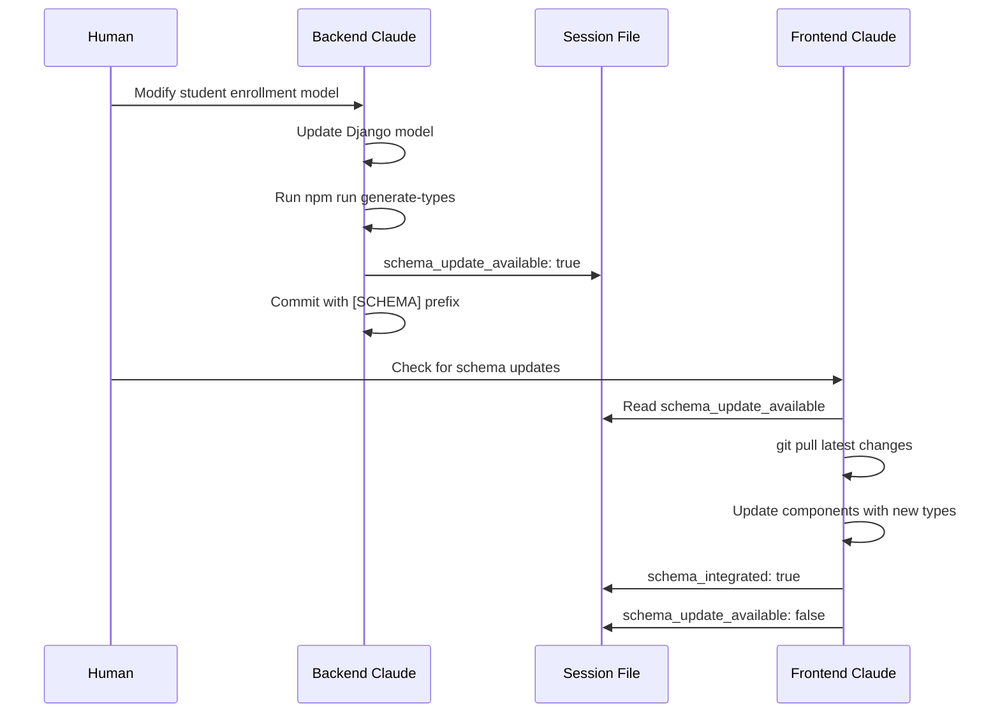

# Dual Claude Coordination - Complete Reference Guide

## 📖 Overview

This document provides comprehensive guidance for coordinating two Claude instances working simultaneously on the Naga SIS monorepo - one focused on backend (Django/API) development and one on frontend (Vue.js/PWA) development.

## 🎯 Core Principles

### Workspace Isolation
- **Physical separation** via Git worktrees prevents file system conflicts
- **Logical separation** via clear domain boundaries (backend vs frontend)
- **Process isolation** via separate terminal sessions and development servers

### Communication Protocol
- **Explicit coordination** via shared JSON session file
- **Clear task boundaries** with minimal overlap
- **Schema synchronization** workflow for API changes
- **Emergency halt** capability for conflict resolution

### Resource Management
- **Port allocation** to prevent service conflicts
- **Database isolation** with separate connection pools
- **Build coordination** to prevent resource contention
- **File locking** system to prevent simultaneous edits

## 🏗️ Technical Architecture

### Git Worktree Strategy
```bash
Main Repository (read-only reference):
/Users/jeffreystark/PycharmProjects/naga-monorepo/

Backend Claude Workspace:
/Users/jeffreystark/PycharmProjects/naga-monorepo-backend/
├── backend/           # Full Django application
├── libs/shared/       # API types (Backend Claude manages)
├── .git/              # Linked to main repository
└── .claude-sessions/  # Coordination system

Frontend Claude Workspace:
/Users/jeffreystark/PycharmProjects/naga-monorepo-frontend/
├── frontend/          # Full Vue.js application  
├── libs/shared/       # API types (Frontend Claude consumes)
├── .git/              # Linked to main repository
└── .claude-sessions/  # Coordination system
```

### Session Coordination File Structure
```json
{
  "metadata": {
    "version": "1.0",
    "created": "2025-01-01T12:00:00Z",
    "last_updated": "2025-01-01T12:00:00Z"
  },
  "backend": {
    "claude_id": "backend-claude-session-[timestamp]",
    "workspace": "naga-monorepo-backend",
    "status": "active|inactive|busy",
    "current_task": "Descriptive task name",
    "last_activity": "2025-01-01T12:00:00Z",
    "files_locked": ["backend/apps/enrollment/", "libs/shared/api-types/"],
    "git_branch": "feature/backend/enrollment-api",
    "services_running": ["django:8000", "postgres:5432", "redis:6379"]
  },
  "frontend": {
    "claude_id": "frontend-claude-session-[timestamp]",
    "workspace": "naga-monorepo-frontend",
    "status": "active|inactive|busy", 
    "current_task": "Descriptive task name",
    "last_activity": "2025-01-01T12:00:00Z",
    "files_locked": ["frontend/src/components/", "frontend/package.json"],
    "git_branch": "feature/frontend/enrollment-ui",
    "services_running": ["vite:3000", "vitest:3001"]
  },
  "coordination": {
    "schema_update_available": false,
    "schema_version": "1.2.3",
    "schema_integrated": true,
    "pending_integrations": [],
    "emergency_halt": false,
    "emergency_reason": "",
    "last_sync": "2025-01-01T12:00:00Z",
    "sync_conflicts": []
  },
  "monitoring": {
    "resource_usage": {
      "cpu_total": "45%",
      "memory_total": "2.1GB", 
      "disk_io": "moderate"
    },
    "performance_metrics": {
      "backend_response_time": "120ms",
      "frontend_build_time": "3.2s",
      "test_execution_time": "45s"
    }
  }
}
```

## 🔄 Operational Workflows

### Session Initialization
```bash
# Human Setup
cd /Users/jeffreystark/PycharmProjects/naga-monorepo
git worktree add ../naga-monorepo-backend main
git worktree add ../naga-monorepo-frontend main
mkdir -p .claude-sessions

# Backend Claude Initialization
cd /Users/jeffreystark/PycharmProjects/naga-monorepo-backend
# Claude reads CLAUDE.md, updates session file, starts services

# Frontend Claude Initialization  
cd /Users/jeffreystark/PycharmProjects/naga-monorepo-frontend
# Claude reads CLAUDE.md, updates session file, starts services
```

### API Schema Change Workflow


### Conflict Resolution Protocol
```bash
# Detection Phase
1. Claude detects file lock conflict
2. Claude checks session file timestamps
3. Claude determines priority (first-lock wins)

# Resolution Phase
1. Lower priority Claude defers operation
2. Update session file with conflict details
3. Notify human via status message
4. Wait for manual intervention if needed

# Recovery Phase
1. Human resolves conflict manually
2. Both Claudes reset their locks
3. Resume operations with updated session
```

## 🛡️ Safety Mechanisms

### File Lock System
```json
{
  "file_locks": {
    "backend/apps/enrollment/models.py": {
      "locked_by": "backend-claude",
      "locked_at": "2025-01-01T12:00:00Z",
      "operation": "model_modification",
      "estimated_duration": "10 minutes"
    }
  }
}
```

### Emergency Halt Triggers
- Simultaneous file modifications detected
- Git merge conflicts in worktrees
- Resource exhaustion (CPU > 90%, Memory > 8GB)
- Service port conflicts
- Database connection pool exhaustion

### Automatic Recovery
```bash
# Session File Corruption
if ! jq . .claude-sessions/active-sessions.json > /dev/null; then
    cp .claude-sessions/backup.json .claude-sessions/active-sessions.json
    echo "Session file restored from backup"
fi

# Stale Lock Cleanup (after 30 minutes)
jq 'del(.backend.files_locked[] | select((.timestamp | fromdateiso8601) < (now - 1800)))' \
   .claude-sessions/active-sessions.json
```

## 📊 Performance Optimization

### Resource Allocation
```yaml
Backend Claude Resources:
  CPU: Up to 50% system capacity
  Memory: Up to 4GB RAM
  Disk I/O: Database operations priority
  Network: API traffic priority
  
Frontend Claude Resources:
  CPU: Up to 40% system capacity (build processes)
  Memory: Up to 2GB RAM
  Disk I/O: Build artifact operations
  Network: Package downloads priority

Reserved Resources:
  CPU: 10% for system operations
  Memory: 2GB for OS and other processes
```

### Build Coordination
```bash
# Staggered Build Schedule
Backend Claude: Run tests on :00, :30 minutes
Frontend Claude: Run tests on :15, :45 minutes

# Shared Cache Strategy
Nx Cache: Shared read access, write locks coordinated
Node Modules: Separate per workspace
Docker Images: Shared base images, separate final images
```

## 🔍 Monitoring and Debugging

### Health Check Commands
```bash
# Check Claude coordination status
cat .claude-sessions/active-sessions.json | jq '.backend.status, .frontend.status'

# Monitor resource usage
ps aux | grep -E "(python|node|docker)" | awk '{sum+=$3} END {print "Total CPU:", sum"%"}'

# Check port conflicts
lsof -i :3000,:8000,:5432,:6379 | grep LISTEN

# Verify git worktree integrity
git worktree list
```

### Debug Information Collection
```bash
# Session State Export
jq '.' .claude-sessions/active-sessions.json > debug-session-$(date +%s).json

# Git State Export  
git status --porcelain > debug-git-$(date +%s).txt
git log --oneline -10 >> debug-git-$(date +%s).txt

# Service State Export
docker ps --format "table {{.Names}}\t{{.Status}}\t{{.Ports}}" > debug-services-$(date +%s).txt
```

## 📚 Best Practices Summary

### Task Assignment Patterns
```yaml
Backend Claude Ideal Tasks:
  - Django model modifications
  - API endpoint implementation  
  - Database migration scripts
  - Backend test suite development
  - API documentation generation

Frontend Claude Ideal Tasks:
  - Vue component development
  - PWA feature implementation
  - UI/UX improvements
  - Frontend test suite development
  - Build optimization

Coordination Required Tasks:
  - API schema changes
  - Root configuration changes (package.json, nx.json)
  - Cross-cutting documentation updates
  - Integration test development
```

### Communication Templates
```bash
# Schema Update Request
"Backend Claude: Please update the [Model] model to include [fields]. Generate TypeScript types and notify Frontend Claude when ready."

# Integration Task
"Frontend Claude: Backend has updated the enrollment API. Please check the session file for schema updates and integrate the new types into the enrollment components."

# Conflict Resolution
"Both Claudes: Please halt operations. I need to resolve a merge conflict manually. Resume after I update the session file."
```

### Success Metrics
```yaml
Coordination Effectiveness:
  - Zero unresolved merge conflicts per session
  - < 5 minute schema sync time
  - < 2% resource conflict incidents
  - 95%+ successful integration test rate

Development Velocity:
  - Parallel feature development capability
  - Reduced context switching overhead
  - Faster iteration cycles
  - Higher code quality through specialization
```

## 🚀 Advanced Patterns

### Multi-Feature Development
```bash
# Parallel feature branches
Backend: feature/backend/enrollment-validation
Frontend: feature/frontend/enrollment-ui

# Coordinated integration branch
Integration: feature/shared/enrollment-system

# Merge strategy
1. Backend completes API implementation
2. Frontend completes UI implementation
3. Integration testing in shared branch
4. Coordinated merge to main
```

### Scaling Considerations
```yaml
Two Claude Limit Rationale:
  - Human cognitive load management
  - Coordination complexity scaling (O(n²))
  - Resource contention minimization
  - Clear responsibility boundaries

Future Scaling Options:
  - Specialized Claude instances (DevOps, Testing, Documentation)
  - Time-boxed Claude rotation
  - Domain-specific Claude coordination
```

---

**Document Version**: 1.0  
**Author**: Naga SIS Development Team  
**Last Updated**: 2025-01-01  
**Next Review**: 2025-04-01

This document should be stored in your Context7 system for easy reference during dual Claude coordination sessions.